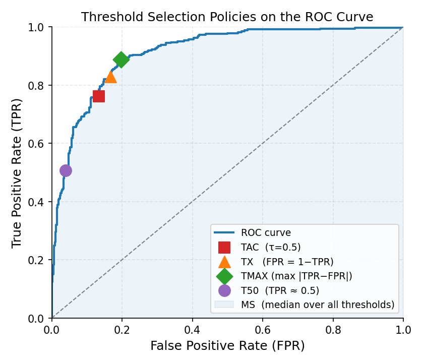
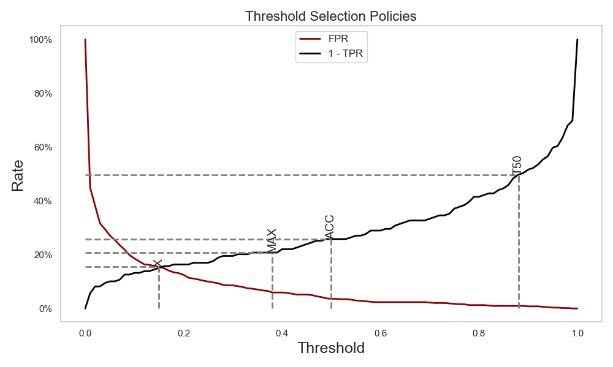

.. _counting:

.. currentmodule:: mlquantify.counting

================
Adjusted Counting
================

Adjusted counting methods correct the bias of naive counting by using what the
classifier's error rates reveal about the true class distribution. They are
the oldest family of dedicated quantification methods (Forman, 2005) and remain
strong baselines for **binary** problems.

.. admonition:: Binary-only, multiclass via OvR

   All methods on this page are fundamentally binary. When you apply them to a
   dataset with more than two classes, ``mlquantify`` automatically decomposes
   the problem into *K* one-vs-rest (OvR) binary subproblems and recombines
   the results. Pass ``strategy='ovo'`` to use one-vs-one instead.

.. contents:: Contents
   :local:
   :depth: 2

----

The Adjustment Formula
======================

All adjusted counting methods share the same core correction derived from the
confusion matrix. Suppose a binary classifier has true positive rate TPR and
false positive rate FPR (estimated on training data). If CC returns an observed
positive proportion :math:`\hat{p}^{CC}`, the adjusted estimate is:

.. math::

   \hat{p}^{AC}(\oplus) = \frac{\hat{p}^{CC}(\oplus) - \text{FPR}}{\text{TPR} - \text{FPR}}

The methods below differ only in **how they pick the threshold** on the ROC
curve at which TPR and FPR are read off. The formula itself is the same for
all of them. (Forman, 2005, 2008)

   *Each threshold-adjustment method picks a different operating point on the ROC
   curve. TAC uses τ=0.5 (red square); TX selects the symmetric crossing point
   (orange triangle); TMAX picks the point of maximum TPR−FPR separation (green
   diamond); T50 targets TPR≈0.5 (purple circle). MS sweeps the shaded area and
   takes the median.*

.. dropdown:: Why the formula works

   Consider the population of test items. Each item can be truly positive or
   negative. The CC count can be decomposed as:

   .. math::

      \hat{p}^{CC} = \text{TPR} \cdot p(\oplus) + \text{FPR} \cdot p(\ominus)

   Solving for :math:`p(\oplus)` gives the AC formula. The correction is
   exact when TPR and FPR are known; in practice they are estimated from
   cross-validated training predictions, so a small estimation error remains.

----

ACC — Adjusted Classify and Count (hard predictions)
======================================================

:class:`ACC` applies the adjustment formula using the classifier's argmax
(hard) predictions, rather than a soft-probability threshold. TPR and FPR
are computed by comparing the classifier's hard labels against the true
training labels.

**Why it exists:** ACC is the "reference" adjusted-counting method described
in Forman (2005). By deriving TPR/FPR from hard predictions it matches the
behaviour expected from the theoretical derivation and avoids threshold
selection entirely.

Parameters
----------

.. list-table::
   :widths: 22 15 63
   :header-rows: 1

   * - Parameter
     - Default
     - Explanation
   * - ``estimator``
     - ``None``
     - A classifier with ``fit``, ``predict``, and optionally ``predict_proba``.
   * - ``strategy``
     - ``'ovr'``
     - Multiclass decomposition strategy (``'ovr'`` or ``'ovo'``).
   * - ``cv``
     - ``5``
     - Folds for cross-validating the confusion matrix. More folds → better
       TPR/FPR estimates but longer fitting. 5–10 is recommended.
   * - ``stratified``
     - ``True``
     - Use stratified folds to ensure rare classes appear in every fold.
       Always leave ``True`` unless your dataset has no class imbalance.
   * - ``shuffle``
     - ``False``
     - Shuffle before splitting. Set ``True`` if data has a natural order.
   * - ``random_state``
     - ``None``
     - Seed for reproducible splits.
   * - ``n_jobs``
     - ``None``
     - Parallel jobs for OvR/OvO decomposition. ``-1`` uses all CPU cores.

Examples
--------

.. code-block:: python

   from mlquantify.counting import ACC
   from sklearn.linear_model import LogisticRegression
   from sklearn.datasets import make_classification
   from sklearn.model_selection import train_test_split

   X, y = make_classification(n_samples=1000, weights=[0.8, 0.2],
                              random_state=42)
   X_train, X_test, y_train, y_test = train_test_split(
       X, y, test_size=0.3, random_state=42)

   q = ACC(LogisticRegression(), cv=5)
   q.fit(X_train, y_train)
   print(q.predict(X_test))
   # {0: 0.79, 1: 0.21}

----

ThresholdAdjustment — Base Class for ROC-Threshold Methods
==========================================================

:class:`ThresholdAdjustment` is the abstract base for all ROC-based adjusted
counting methods. Subclasses implement :meth:`get_best_threshold` to select
the threshold at which to evaluate TPR and FPR. The adjustment formula is
then applied at that chosen point.

You can subclass it to implement custom threshold-selection policies:

.. code-block:: python

   from mlquantify.counting import ThresholdAdjustment
   import numpy as np

   class HalfTPR(ThresholdAdjustment):
       """Select the threshold where TPR ≈ 0.5."""
       def get_best_threshold(self, thresholds, tprs, fprs):
           idx = np.argmin(np.abs(tprs - 0.5))
           return thresholds[idx], tprs[idx], fprs[idx]

----

TAC — Threshold Adjusted Count (fixed threshold)
=================================================

:class:`TAC` evaluates TPR and FPR at a **fixed threshold** (default 0.5)
and applies the AC formula at that single point.

**Why it exists:** TAC is the simplest threshold-adjustment method. It uses
the natural decision boundary of the classifier without any search. It is
often dominated by methods that pick a better threshold, but serves as a
useful reference.

Parameters
----------

.. list-table::
   :widths: 22 15 63
   :header-rows: 1

   * - Parameter
     - Default
     - Explanation
   * - ``estimator``
     - ``None``
     - Probabilistic classifier (``predict_proba`` needed).
   * - ``threshold``
     - ``0.5``
     - The classification threshold at which TPR/FPR are evaluated. Change
       this when you know your classifier works better at a non-default cutoff
       (e.g. 0.3 for imbalanced classes).
   * - ``cv``
     - ``5``
     - Folds for cross-validating soft scores used to build the ROC curve.
   * - ``stratified``
     - ``True``
     - See :class:`ACC`.
   * - ``strategy``
     - ``'ovr'``
     - Multiclass decomposition.
   * - ``n_jobs``
     - ``None``
     - Parallel jobs for decomposition.

Examples
--------

.. code-block:: python

   from mlquantify.counting import TAC
   from sklearn.linear_model import LogisticRegression

   q = TAC(LogisticRegression(), threshold=0.5)
   q.fit(X_train, y_train)
   print(q.predict(X_test))
   # {0: 0.79, 1: 0.21}

----

TX — Threshold X (symmetric ROC point)
========================================

:class:`TX` selects the threshold where :math:`\text{FPR} = 1 - \text{TPR}`,
i.e., the intersection of the FPR curve and the (1 − TPR) curve. This
corresponds to the point on the ROC curve equidistant from both axes.

**Why it exists:** At this symmetric point the classifier makes a balanced
tradeoff between false positives and false negatives, which tends to give a
stable AC estimate. Forman (2005) found TX competitive across many benchmark
tasks.

.. code-block:: python

   from mlquantify.counting import TX
   from sklearn.linear_model import LogisticRegression

   q = TX(LogisticRegression())
   q.fit(X_train, y_train)
   print(q.predict(X_test))

----

TMAX — Maximum TPR−FPR Separation
====================================

:class:`TMAX` selects the threshold that maximises :math:`|\text{TPR} - \text{FPR}|`,
which is the point of highest discriminative power on the ROC curve.

**Why it exists:** A large :math:`\text{TPR} - \text{FPR}` gap makes the AC
denominator large and keeps the adjusted estimate numerically stable. TMAX is
useful when the classifier has a clear peak in discriminative power.

.. code-block:: python

   from mlquantify.counting import TMAX
   from sklearn.linear_model import LogisticRegression

   q = TMAX(LogisticRegression())
   q.fit(X_train, y_train)
   print(q.predict(X_test))

----

T50 — TPR ≈ 0.5 Threshold
============================

:class:`T50` selects the threshold where the true positive rate is closest
to 0.5, placing the operating point in the middle of the ROC curve.

**Why it exists:** Extreme thresholds (near 0 or 1 on the ROC) can yield
unstable estimates when TPR or FPR is close to 0. T50 avoids both extremes,
giving a conservative but robust estimate. Forman (2005) introduced it as
an alternative to TX.

.. code-block:: python

   from mlquantify.counting import T50
   from sklearn.linear_model import LogisticRegression

   q = T50(LogisticRegression())
   q.fit(X_train, y_train)
   print(q.predict(X_test))

----

MS — Median Sweep
=================

:class:`MS` applies the AC formula at **every** threshold on the ROC curve
and returns the **median** of all resulting prevalence estimates.

.. math::

   \hat{p}^{MS}(\oplus) = \text{median}_{\tau} \left\{
       \frac{\hat{p}^{CC}_{\tau}(\oplus) - \text{FPR}_\tau}{\text{TPR}_\tau - \text{FPR}_\tau}
   \right\}

**Why it exists:** Any single-threshold method is sensitive to the exact
threshold it picks. By sweeping all thresholds and taking the median, MS is
robust to a bad individual threshold. Forman (2008) showed it is often the
most accurate method across a wide range of test prevalences.

.. code-block:: python

   from mlquantify.counting import MS
   from sklearn.linear_model import LogisticRegression

   q = MS(LogisticRegression())
   q.fit(X_train, y_train)
   print(q.predict(X_test))

----

MS2 — Median Sweep with Constraint
====================================

:class:`MS2` is a constrained variant of :class:`MS`. It only uses
thresholds where :math:`|\text{TPR} - \text{FPR}| > 0.25`, discarding
regions of the ROC curve where the classifier is nearly non-discriminative
(and where the AC denominator is close to zero, causing numerical instability).

**Why it exists:** Thresholds where TPR ≈ FPR inflate the adjusted estimate
wildly. MS2 filters them out before taking the median, making it more stable
than MS on noisy classifiers. Forman (2008) introduced it as an improvement
over plain MS.

Parameters
----------

.. list-table::
   :widths: 22 15 63
   :header-rows: 1

   * - Parameter
     - Default
     - Explanation
   * - ``estimator``
     - ``None``
     - Probabilistic classifier.
   * - ``cv``
     - ``5``
     - Cross-validation folds for the soft score distribution.
   * - ``stratified``
     - ``True``
     - Stratified folds.
   * - ``strategy``
     - ``'ovr'``
     - Multiclass decomposition.
   * - ``n_jobs``
     - ``None``
     - Parallel jobs.

.. code-block:: python

   from mlquantify.counting import MS2
   from sklearn.linear_model import LogisticRegression

   q = MS2(LogisticRegression())
   q.fit(X_train, y_train)
   print(q.predict(X_test))

----

Comparing Threshold-Adjustment Methods
========================================

.. list-table::
   :widths: 12 30 30 28
   :header-rows: 1

   * - Method
     - Threshold rule
     - Strength
     - Use when
   * - ACC
     - Hard-prediction argmax
     - Exact AC derivation; no threshold to choose
     - You want the canonical AC method
   * - TAC
     - Fixed :math:`\tau` (default 0.5)
     - Simplest; good when calibrated at 0.5
     - Classifier is calibrated at default threshold
   * - TX
     - :math:`\text{FPR} = 1 - \text{TPR}`
     - Balanced operating point
     - General-purpose binary quantification
   * - TMAX
     - Max :math:`|\text{TPR} - \text{FPR}|`
     - Most stable denominator
     - Classifier has a sharp discrimination peak
   * - T50
     - TPR closest to 0.5
     - Avoids extreme thresholds
     - Unstable estimates at extreme thresholds
   * - MS
     - Median over all thresholds
     - Robust to threshold choice
     - **Default choice**; works well on most tasks
   * - MS2
     - Median over :math:`|\text{TPR}-\text{FPR}|>0.25`
     - Stable on noisy classifiers
     - Classifier has poor discrimination in parts of ROC

**Practical recommendation:** Start with **MS** or **MS2** — Forman (2008)
showed they consistently outperform single-threshold methods. If you want
the canonical ACC correction without ROC sweep, use **ACC**.

.. seealso::

   :ref:`counters_module` for the simpler CC / PCC / GACC / GPACC family.
   :ref:`likelihood` for EMQ, which usually outperforms adjusted counting.

Adjusted Counting methods improve upon simple "counting" quantifiers by correcting bias using what is known about the classifier's errors on the training set.  
They aim to produce better estimates of class prevalence (how frequent each class is in a dataset) even when training and test distributions differ.

see :ref:`counters_module` for an overview of the base counters for quantification.

This page focuses on **threshold adjustment methods**, which adjust the decision
threshold of a classifier to optimize prevalence estimation. Examples include
Adjusted Count (TAC) and its threshold selection policies (TX, TMAX, T50, MS,
MS2).

Threshold Adjustment
====================

Threshold-based adjustment methods correct the bias of :class:`CC` by using the classifier's **True Positive Rate (TPR)** and **False Positive Rate (FPR)**.  
They are mainly used for `binary` quantification tasks.

**Threshold Adjusted Count (TAC) Equation**

.. math::

   \hat{p}^U_{TAC}(⊕) = \frac{\hat{p}^U_{CC}(⊕) - FPR_L}{TPR_L - FPR_L}

:caption: *Corrected prevalence estimate using classifier error rates*

The main idea is that by adjusting the observed rate of positive predictions, we can better approximate the real class distribution.

   *Comparison of different threshold selection policies showing FPR and 1-TPR curves with optimal thresholds for each method [Adapted from Forman (2008)]*

Different *threshold methods* vary in how they choose the classifier cutoff :math:`\tau` for scores :math:`s(x)` .

+----------------------------+------------------------------------------------------+-----------------------------------------+
| **Method**                 | **Threshold Choice**                                 | **Goal**                                |
+----------------------------+------------------------------------------------------+-----------------------------------------+
| :class:`TAC`               | Fixed threshold :math:`\tau = 0.5`                   | Simple baseline adjustment              |
+----------------------------+------------------------------------------------------+-----------------------------------------+
| :class:`TX`          | Threshold where :math:`\text{FPR} = 1 - \text{TPR}`  | Avoids unstable prediction tails        |
+----------------------------+------------------------------------------------------+-----------------------------------------+
| :class:`TMAX`               | Threshold maximizing :math:`\text{TPR} - \text{FPR}` | Improves numerical stability            |
+----------------------------+------------------------------------------------------+-----------------------------------------+
| :class:`T50`               | Threshold where :math:`\text{TPR} = 0.5`             | Uses central part of ROC curve          |
+----------------------------+------------------------------------------------------+-----------------------------------------+
| :class:`MS` (Median Sweep) | Median of all thresholds' ACC results                | Reduces effect of threshold outliers    |
+----------------------------+------------------------------------------------------+-----------------------------------------+
| :class:`MS2`               | Median Sweep variant with constraint                 | Reduces effect of threshold outliers    |
|                            | :math:`\|\text{TPR} - \text{FPR}\| > 0.25`           |                                         |
+----------------------------+------------------------------------------------------+-----------------------------------------+

All these methods have their `fit`, `predict` and `aggregate` functions, similar to other aggregative quantifiers. However, they also include a specialized method: `get_best_thresholds`, which identifies the optimal threshold, given `y` and predicted `probabilities`. Here is an example of how to use the :class:`T50` method:

.. code-block:: python

   from mlquantify.counting import T50, evaluate_thresholds
   from sklearn.linear_model import LogisticRegression

   clf = LogisticRegression()

   thresholds, tprs, fprs = evaluate_thresholds(
      y=y_test, 
      probabilities=clf.predict_proba(X_test)[:, 1]) # binary proba

   q = T50()
   best_thr, best_tpr, best_fpr = q.get_best_thresholds(X_val, y_val)
   print(f"Best threshold: {best_thr}, TPR: {best_tpr}, FPR: {best_fpr}")

.. note::

   Threshold adjustment methods like :class:`TAC` are primarily designed for binary classification tasks.
