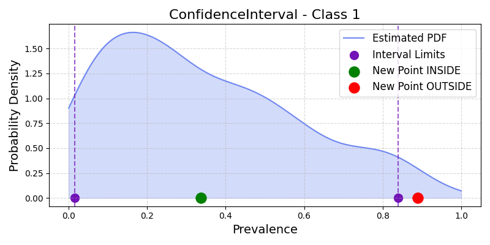
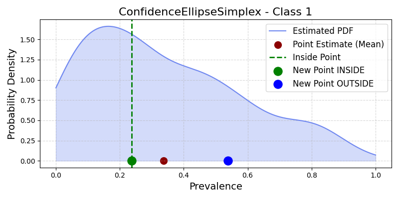
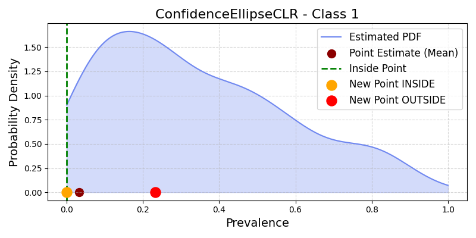

.. _confidence_intervals_quantification:

Confidence Regions for Quantification
=====================================

This guide details the main types of confidence regions for prevalence estimates in quantification, as implemented in :mod:`mlquantify.confidence`. It covers the principles, mathematical definitions, attributes, and usage examples for each region type.

For advanced bootstrap-based strategies (e.g., model-based and population-based), see :mod:`mlquantify.meta.AggregativeBootstrap`, which provides detailed implementations.

===============
General Concept
===============

A confidence region for quantification is a subset in the prevalence space that, with probability :math:`1-\alpha`, contains the unknown true class prevalence vector :math:`\pi^*` of the test set. The width and shape of this region express uncertainty around the point estimate. Typical regions are defined as :math:`CR_\alpha` such that

.. math::

    \mathbb{P}\left(\pi^{\ast} \in CR_{\alpha}\right) = 1 - \alpha

where :math:`\pi^{\ast}` is the true prevalence vector.

Confidence region types differ by how they model joint uncertainty across class prevalences:

- **Confidence intervals** (by percentiles)
- **Confidence ellipse in simplex** (multivariate)
- **Confidence ellipse in CLR space** (geometry-aware)

All regions are constructed from :math:`m` bootstrap resamples of prevalences for :math:`n` classes: :math:`X \in \mathbb{R}^{m \times n}`.

API Reference: :class:`BaseConfidenceRegion` (in :mod:`mlquantify.confidence`).

.. _confidence_intervals:
=====================================
Percentile-Based Confidence Intervals
=====================================

Implements independent confidence intervals for each class based on percentiles (nonparametric, assumes independence).

:class:`ConfidenceInterval`

    *Illustration of Confidence Intervals for the positive class*

- **Definition:** For a desired confidence :math:`1-\alpha`, compute interval bounds :math:`[L_i, U_i]` for each class :math:`i` from the empirical :math:`\alpha/2` and :math:`1-\alpha/2` percentiles.
- **Mathematical region:**

    .. math::
      CI_\alpha(\pi) =
      \begin{cases}
      1 & \text{if } L_i \leq \pi_i \leq U_i, \forall i=1,...,n \\
      0 & \text{otherwise}
      \end{cases}

- **Limitations:** Assumes class independence; region is a hyper-rectangle which can fall outside the probability simplex.

**Example:**

.. code-block:: python

    from mlquantify.confidence import ConfidenceInterval
    import numpy as np

    X = np.random.dirichlet(np.ones(3), size=200)
    ci = ConfidenceInterval(X, confidence_level=0.9)
    print(ci.get_region())  # returns (I_low, I_high)
    print(ci.contains([0.3, 0.4, 0.3]))  # array([[True]])

.. _confidence_ellipse_simplex:

=============================
Confidence Ellipse in Simplex
=============================

Constructs a multivariate confidence ellipse in the simplex space, enforcing joint uncertainty and correlations.

:class:`ConfidenceEllipseSimplex`

    *Illustration of Confidence Ellipse in Simplex space for the positive class*

- **Definition:** Derives an ellipse around the mean prevalence vector, with axes scaled by covariance, thresholded via chi-squared statistic.
- **Mathematical region:**

    .. math::
      CE_\alpha(\pi) =
      \begin{cases}
      1 & \text{if } (\pi-\mu)^T\Sigma^{-1}(\pi-\mu) \leq \chi^2_{n-1}(1-\alpha) \\
      0 & \text{otherwise}
      \end{cases}

- **Attributes:**
    - :math:`\mu`: sample mean of bootstrap prevalences
    - :math:`\Sigma^{-1}`: inverse covariance matrix
    - :math:`\chi^2_{n-1}(1-\alpha)`: chi-squared cutoff

- **Limitations:** Assumes normality of prevalence estimates (may not hold); region may partially extend beyond the simplex.

**Example:**

.. code-block:: python

    from mlquantify.confidence import ConfidenceEllipseSimplex
    import numpy as np

    X = np.random.dirichlet(np.ones(3), size=200)
    ce = ConfidenceEllipseSimplex(X, confidence_level=0.95)
    print(ce.get_point_estimate())
    print(ce.contains(np.array([0.4, 0.3, 0.3])))

.. _confidence_ellipse_clr:

===============================
Confidence Ellipse in CLR Space
===============================

Models the geometry of the simplex by transforming prevalence vectors using the Centered Log-Ratio (CLR) transformation before constructing the ellipse.

:class:`ConfidenceEllipseCLR`

    *Illustration of Confidence Ellipse in CLR space for the positive class*

- **CLR transformation:** :math:`T: \Delta^{n-1} \rightarrow \mathbb{R}^n`, with

    .. math::
      T(\pi) = [\log(\pi_1 / g(\pi)), \ldots, \log(\pi_n / g(\pi))], \quad g(\pi) = (\prod_i \pi_i)^{1/n}

- **Region definition:**

    .. math::
      CT_\alpha(\pi) =
      \begin{cases}
      1 & \text{if } (T(\pi) - \mu_{CLR})^T \Sigma^{-1} (T(\pi) - \mu_{CLR}) \leq \chi^2_{n-1}(1-\alpha) \\
      0 & \text{otherwise}
      \end{cases}

- **Attributes:** As above, but all computations done in the transformed CLR space.

- **Advantages:** Adapts to the compositional nature of prevalence estimates, keeping the region well-behaved within the simplex.

**Example:**

.. code-block:: python

    from mlquantify.confidence import ConfidenceEllipseCLR
    import numpy as np

    X = np.random.dirichlet(np.ones(3), size=200)
    clr = ConfidenceEllipseCLR(X, confidence_level=0.9)
    print(clr.get_point_estimate())
    print(clr.contains(np.array([0.4, 0.4, 0.2])))

References
----------

- Moreo, A., & Salvati, N. (2025). *An Efficient Method for Deriving Confidence Intervals in Aggregative Quantification*. Istituto di Scienza e Tecnologie dell'Informazione, CNR, Pisa.

- See also: Section 3.3 and Equations (1)-(3) in the reference above.

