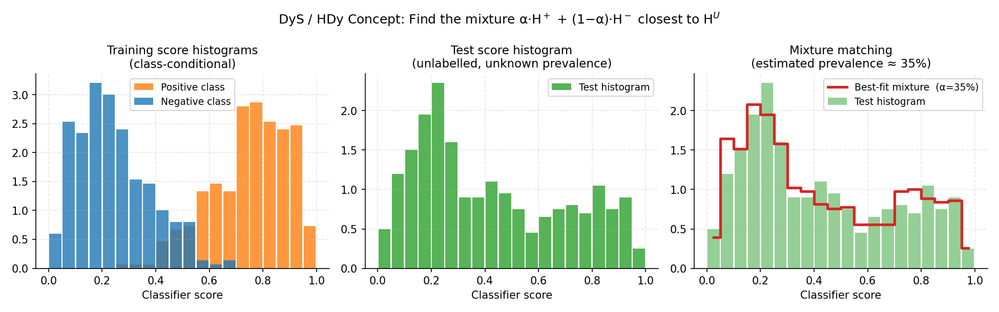

.. _distribution_matching:

.. currentmodule:: mlquantify.matching

======================
Distribution Matching
======================

Distribution matching (DM) methods estimate prevalences without inverting a
confusion matrix or re-weighting posteriors. Instead, they find the mixture
proportion of class-conditional distributions that best **reproduces** the
observed test distribution. Like the other families they target **prior
probability shift** — the class priors change between train and test while
:math:`p(x \mid y)` stays fixed — but they handle non-standard classifiers and
multiclass problems natively.

**Core idea:** During training, DM methods learn a *representation*
:math:`r_c` of each class's distribution (a histogram, density, kernel mean,
…). At test time, they find the prevalence vector :math:`\hat{p}` such that
the mixture

.. math::

   \sum_c \hat{p}(c) \cdot r_c \;\approx\; r_U

is as close as possible to the test representation :math:`r_U`, under some
dissimilarity measure. This is solved as a constrained optimisation over the
probability simplex.

``mlquantify`` organises distribution matching into four representation
families — **histogram**, **density (KDE)**, **kernel**, and **scores** — all
exposed through :mod:`mlquantify.matching`.

.. contents:: Contents
   :local:
   :depth: 2

----

Histogram Methods
=================

Histogram methods discretise the classifier's score distribution into bins.
They are the oldest DM family and remain competitive on binary problems.

.. admonition:: Binary-only (unless noted)

   Histogram methods are fundamentally binary. ``mlquantify`` applies OvR
   decomposition automatically for multiclass datasets.

DyS — Distribution y-Similarity
---------------------------------

:class:`DyS` (Maletzke et al., 2019) builds a histogram of classifier scores
for each class from cross-validated predictions. At test time it searches for
the mixture proportion :math:`\alpha \in [0,1]` that minimises a dissimilarity
measure between the test score histogram and the mixture of class histograms:

.. math::

   \hat{p}^{DyS}(\oplus) = \arg\min_{\alpha \in [0,1]}
   D\!\left( \alpha \cdot H_+ + (1-\alpha) \cdot H_- ,\; H_U \right)

**Why it excels:** DyS is a *framework* that separates the representation
(histogram), the dissimilarity measure, and the solver. It can be configured
with any distance and bin size. Maletzke et al. (2019) showed it beats
threshold-adjustment methods and matches EMQ on many benchmarks.

Parameters
----------

.. list-table::
   :widths: 22 15 63
   :header-rows: 1

   * - Parameter
     - Default
     - Explanation
   * - ``estimator``
     - ``None``
     - Probabilistic classifier (``predict_proba``). Its cross-validated scores
       are used to build the class histograms.
   * - ``bins_size``
     - ``None``
     - Number of histogram bins, or an array of bin counts to sweep. If
       ``None``, a default logarithmic grid is used. Larger bins give a
       coarser representation (more stable but less expressive); smaller bins
       capture more detail but are noisier with limited training data.
   * - ``distance``
     - ``'topsoe'``
     - Dissimilarity measure between histograms. Options:

       - ``'topsoe'`` (default) — Jensen–Shannon-like, recommended for DyS.
       - ``'hellinger'`` — square root of half the chi-squared distance.
       - ``'probsymm'`` — probabilistic symmetric chi-squared.

       The distance choice affects which solver is optimal (see ``solver``).
   * - ``solver``
     - ``'auto'``
     - Optimisation algorithm for the mixture search:

       - ``'auto'`` — chooses ``'ternary'`` for Hellinger/TopSoe/ProbSymm
         (these have a single minimum), ``'grid'`` otherwise.
       - ``'ternary'`` — faster for unimodal objectives.
       - ``'grid'`` — exhaustive search over a fine grid; always finds the
         global minimum but slower.
   * - ``bin_strategy``
     - ``None``
     - How to aggregate results across multiple bin sizes. ``None`` uses a
       single bin count; ``'median'`` or ``'mean'`` averages across all bin
       sizes in ``bins_size`` (more robust).
   * - ``laplace_smoothing``
     - ``False``
     - Add Laplace (add-one) smoothing to histogram counts. Prevents zero-bin
       issues when training data is scarce.
   * - ``cv``
     - ``None``
     - Cross-validation folds for computing training scores. ``None`` uses 5.
   * - ``stratified``
     - ``True``
     - Stratified folds.
   * - ``strategy``
     - ``'ovr'``
     - Multiclass decomposition.

   *Left: class-conditional score histograms learned from training data.
   Centre: test score histogram (unlabelled — unknown prevalence).
   Right: DyS searches for the mixture proportion α that makes
   α·H⁺ + (1−α)·H⁻ (red step line) match the test histogram (green bars)
   as closely as possible.*

Examples
--------

Basic binary usage:

.. code-block:: python

   from mlquantify.matching import DyS
   from sklearn.linear_model import LogisticRegression
   from sklearn.datasets import make_classification
   from sklearn.model_selection import train_test_split

   X, y = make_classification(n_samples=1000, weights=[0.8, 0.2],
                              random_state=42)
   X_train, X_test, y_train, y_test = train_test_split(
       X, y, test_size=0.3, random_state=42)

   q = DyS(estimator=LogisticRegression())
   q.fit(X_train, y_train)
   print(q.predict(X_test))
   # {0: 0.79, 1: 0.21}

Customising bins and distance:

.. code-block:: python

   import numpy as np
   from mlquantify.matching import DyS
   from sklearn.linear_model import LogisticRegression

   q = DyS(
       estimator=LogisticRegression(),
       bins_size=np.arange(2, 32, 2),   # sweep 2,4,6,...,30 bins
       distance='hellinger',
       bin_strategy='median',           # median across all bin sizes
       laplace_smoothing=True,
   )
   q.fit(X_train, y_train)
   print(q.predict(X_test))

Using :meth:`aggregate` with pre-computed scores:

.. code-block:: python

   import numpy as np
   from mlquantify.matching import DyS
   from sklearn.linear_model import LogisticRegression

   clf = LogisticRegression().fit(X_train, y_train)
   # Positive-class scores (column 1)
   train_scores = clf.predict_proba(X_train)[:, 1]
   test_scores  = clf.predict_proba(X_test)[:, 1]

   q = DyS(clf)
   q.fit(X_train, y_train)
   print(q.aggregate(test_scores, train_scores, y_train))

----

HDy — Hellinger Distance y-Similarity
---------------------------------------

:class:`HDy` (González-Castro et al., 2013) is a specific instantiation of
the DyS framework that sweeps over multiple bin sizes
(:math:`10, 20, \ldots, 110` by default) and returns the **median** prevalence
across all bin sizes. It uses the Hellinger distance as the dissimilarity.

**Why it exists:** HDy was the original paper that introduced the idea of
comparing score histograms for quantification. The multi-bin median strategy
reduces sensitivity to the bin count hyperparameter, making HDy robust without
tuning.

Parameters
----------

Same structure as :class:`DyS`. Key defaults:

- ``distance='hellinger'``
- ``bin_strategy='median'``
- ``bins_size=np.linspace(10, 110, 11, dtype=int)``

.. code-block:: python

   from mlquantify.matching import HDy
   from sklearn.linear_model import LogisticRegression

   q = HDy(estimator=LogisticRegression())
   q.fit(X_train, y_train)
   print(q.predict(X_test))

----

HDx — Hellinger Distance x-Similarity (classifier-free)
---------------------------------------------------------

:class:`HDx` (González-Castro et al., 2013) compares class-conditional
**feature histograms** directly, without using a classifier. For each
feature, it builds a histogram for each class; the mixture of feature
histograms that best matches the test histogram gives the prevalence estimate.

**Why it exists:** HDx is a *non-aggregative* histogram method — it does not
need a classifier at all. It is useful when no reliable classifier is
available, or as a sanity check. Performance is generally below HDy/DyS
(which use a classifier's summary score), but it is a zero-cost baseline.

Parameters
----------

.. list-table::
   :widths: 22 15 63
   :header-rows: 1

   * - Parameter
     - Default
     - Explanation
   * - ``bins_size``
     - ``None``
     - Array of bin counts to sweep (default: ``[2,4,6,...,20,30]``).
   * - ``strategy``
     - ``'ovr'``
     - Multiclass decomposition.

.. code-block:: python

   from mlquantify.matching import HDx

   q = HDx()
   q.fit(X_train, y_train)
   print(q.predict(X_test))
   # No classifier needed

----

SMM — Score Mixture Model
--------------------------

:class:`SMM` extends DyS to use a more flexible representation of the
score distribution. Parameters match :class:`DyS`.

----

Density Methods — KDEy
========================

KDE-based methods replace histograms with smooth **kernel density estimates**
(KDE), avoiding bin-count sensitivity while still matching distributions.

KDEy-HD, KDEy-CS, KDEy-ML
----------------------------

The three KDEy variants (Moreo et al., 2024) share the same architecture:
they build a KDE over classifier posteriors on the training data (for each
class) and minimise a dissimilarity to the test KDE at prediction time. They
differ in the dissimilarity used:

- :class:`KDEyHD` — Hellinger distance between KDEs.
- :class:`KDEyCS` — squared cosine distance between KDEs.
- :class:`KDEyML` — maximises the mixture log-likelihood (equivalent to
  minimising negative log-likelihood).

**Why they exist:** KDEy methods are **natively multiclass** (unlike DyS/HDy)
and avoid the histogram bin-count hyperparameter. Moreo et al. (2024) showed
they are state-of-the-art for multiclass quantification.

Parameters
----------

.. list-table::
   :widths: 22 15 63
   :header-rows: 1

   * - Parameter
     - Default
     - Explanation
   * - ``estimator``
     - ``None``
     - Probabilistic classifier.
   * - ``bandwidth``
     - ``0.1``
     - KDE bandwidth (smoothing). Smaller values give sharper densities
       (more variance), larger values smooth them out (more bias). Use
       cross-validation to tune: try ``[0.01, 0.05, 0.1, 0.2, 0.5]``.
   * - ``kernel``
     - ``'gaussian'``
     - KDE kernel type. ``'gaussian'`` works well for probability scores in
       :math:`[0,1]`. Matches ``sklearn.neighbors.KernelDensity`` options.
   * - ``solver``
     - ``'slsqp'``
     - Optimisation solver for the simplex-constrained mixture problem.
   * - ``cv``
     - ``None``
     - Cross-validation folds.
   * - ``stratified``
     - ``True``
     - Stratified folds.

Examples
--------

Binary with KDEyHD:

.. code-block:: python

   from mlquantify.matching import KDEyHD
   from sklearn.linear_model import LogisticRegression

   q = KDEyHD(estimator=LogisticRegression(), bandwidth=0.1)
   q.fit(X_train, y_train)
   print(q.predict(X_test))

Multiclass with KDEyML (best accuracy):

.. code-block:: python

   from mlquantify.matching import KDEyML
   from sklearn.linear_model import LogisticRegression
   from sklearn.datasets import make_classification

   X, y = make_classification(n_samples=800, n_classes=4,
                              n_informative=6, n_redundant=0,
                              random_state=42)
   X_train, X_test = X[:600], X[600:]
   y_train = y[:600]

   q = KDEyML(LogisticRegression(), bandwidth=0.05)
   q.fit(X_train, y_train)
   print(q.predict(X_test))

Tuning bandwidth with grid search:

.. code-block:: python

   from mlquantify.model_selection import GridSearchQ
   from mlquantify.matching import KDEyHD
   from mlquantify.model_selection import APP
   from mlquantify.metrics import MAE
   from sklearn.linear_model import LogisticRegression

   protocol = APP(batch_size=100, n_prevalences=21, repeats=5)
   gs = GridSearchQ(
       quantifier=KDEyHD(LogisticRegression()),
       param_grid={'bandwidth': [0.01, 0.05, 0.1, 0.2, 0.5]},
       protocol=protocol,
       error=MAE,
   )
   gs.fit(X_train, y_train)
   print(gs.best_params_)

.. tip::

   Use **KDEyML** for multiclass problems — it is consistently the most
   accurate KDE variant in Moreo et al. (2024)'s benchmark. Use **KDEyHD**
   for binary problems if you want a fast alternative to DyS.

----

Kernel Methods — MMD
======================

:class:`MMD_RKHS` (Maximum Mean Discrepancy in Reproducing Kernel Hilbert
Space) matches class-conditional **kernel mean embeddings** of the raw
feature vectors, rather than classifier scores. It directly computes the
kernel mean of each class in feature space and finds the mixture that
minimises the MMD to the test kernel mean.

**Why it exists:** MMD_RKHS is a **non-aggregative** method (no classifier
needed) that works directly on the feature space via a kernel trick. It is
useful when features are naturally compared with a kernel (e.g. strings,
graphs, or dense embeddings). Iyer et al. (2014) showed strong convergence
guarantees for kernel quantification.

Parameters
----------

.. list-table::
   :widths: 22 15 63
   :header-rows: 1

   * - Parameter
     - Default
     - Explanation
   * - ``kernel``
     - ``'rbf'``
     - Kernel function for computing the RKHS mean embedding. Options:
       ``'rbf'``, ``'linear'``, ``'poly'``, ``'sigmoid'``, ``'cosine'``.
       ``'rbf'`` works well for continuous features.
   * - ``gamma``
     - ``None``
     - RBF/poly/sigmoid bandwidth. ``None`` uses ``1/n_features``. Tune this
       if features are on very different scales (consider normalising first).
   * - ``degree``
     - ``3``
     - Polynomial degree for ``'poly'`` kernel.
   * - ``coef0``
     - ``0.0``
     - Independent term for poly/sigmoid kernels.
   * - ``solver``
     - ``'slsqp'``
     - Optimisation solver.

.. code-block:: python

   from mlquantify.matching import MMD_RKHS

   q = MMD_RKHS(kernel='rbf', gamma=0.1)
   q.fit(X_train, y_train)      # No classifier — works on raw features
   print(q.predict(X_test))

----

Score Methods — SORD
======================

:class:`SORD` (Score-based Optimal Ranking Distribution) estimates prevalence
by comparing the *ranked order* of classifier scores between the test set
and the mixture of class-conditional training scores, using an earth-mover-style
distance.

**Why it exists:** SORD operates on the continuous score values without
discretisation (no bins needed) and without density estimation. It is fast,
parameter-free (beyond the classifier), and competitive with histogram methods.

.. code-block:: python

   from mlquantify.matching import SORD
   from sklearn.linear_model import LogisticRegression

   q = SORD(estimator=LogisticRegression())
   q.fit(X_train, y_train)
   print(q.predict(X_test))

----

Choosing a Distribution Matching Method
=========================================

.. list-table::
   :widths: 12 12 12 18 46
   :header-rows: 1

   * - Method
     - Multiclass
     - Needs clf
     - Key hyperparameter
     - Best for
   * - DyS
     - ✗ (OvR)
     - ✓
     - ``bins_size``, ``distance``
     - Binary; strong with median-sweep bins.
   * - HDy
     - ✗ (OvR)
     - ✓
     - ``bins_size``
     - Binary; tuning-free median-sweep baseline.
   * - HDx
     - ✗ (OvR)
     - ✗
     - ``bins_size``
     - No classifier available; sanity check.
   * - KDEyHD
     - ✓
     - ✓
     - ``bandwidth``
     - Binary & multiclass; smooth density matching.
   * - KDEyML
     - ✓
     - ✓
     - ``bandwidth``
     - **Multiclass; best overall accuracy.**
   * - MMD_RKHS
     - ✓
     - ✗
     - ``kernel``, ``gamma``
     - Kernel-based features; no classifier needed.
   * - SORD
     - ✗ (OvR)
     - ✓
     - None
     - Binary; parameter-free, fast.

**Practical recommendation:**

- For **binary** problems: **DyS** or **MS** (threshold-adjustment) are strong.
- For **multiclass** problems: **KDEyML** is the recommended starting point.
- When no classifier is available: **HDx** or **MMD_RKHS**.
- For a parameter-free binary option: **SORD**.

Assumptions and when to use
===========================

- **What must hold.** Distribution matching is unbiased when the chosen
  representation (scores, features, densities or embeddings) has a
  class-conditional distribution that is invariant across train and test — i.e.
  under prior probability shift — and the per-class representations are
  sufficiently distinct.
- **When it fails.** Sparse or high-dimensional representations (too many
  histogram bins, very small test bags) make the matched distance noisy.
  Histogram methods are bin-sensitive; KDE, kernel and energy methods avoid
  binning.
- **Best suited for.** Binary problems (:class:`DyS`, :class:`HDy`,
  :class:`SORD`) and multiclass problems with several classes
  (:class:`KDEyML`, :class:`EDy`, :class:`MMD_RKHS`), where counting-based
  correction struggles.

References
==========

.. dropdown:: References

   - González-Castro, V., Alaiz-Rodríguez, R., & Alegre, E. (2013). Class
     Distribution Estimation Based on the Hellinger Distance. *Information
     Sciences*, 218, 146–164.
   - Maletzke, A., dos Reis, D., Cherman, E., & Batista, G. (2019). DyS: A
     Framework for Mixture Models in Quantification. *AAAI*, 4552–4560.
   - Moreo, A., González, P., & del Coz, J. J. (2024). Kernel Density
     Estimation for Multiclass Quantification. *Machine Learning*, 113,
     3075–3107.

.. seealso::

   :ref:`likelihood` for EMQ, which is often as good as or better than DM
   methods under pure prior probability shift.
