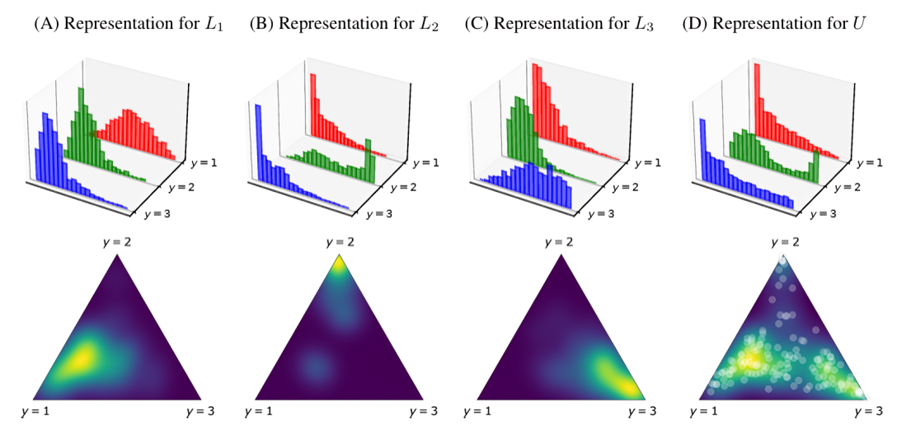

.. _distribution_matching:

.. currentmodule:: mlquantify.matching

======================
Distribution Matching
======================

Distribution Matching (DM) methods estimate prevalences by matching the test
distribution to a mixture of class-conditional distributions learned on the
training data. In practice, the matching strategy depends on how distributions
are represented.

The matching module is organized around four representation families:

- **Histogram:** histogram-based matching (DyS, HDy, SMM).
- **Density:** KDE-based matching over the probability simplex (KDEy variants).
- **Kernel:** kernel mean matching in RKHS (MMD_RKHS).
- **Scores:** matching directly on score samples (SORD).

.. dropdown:: Mathematical details - Mixture Formulation

    The observed distribution in the test set is approximated as:

    .. math::

       D_U \approx \hat{p} \cdot D_+ + (1 - \hat{p}) \cdot D_-

    DM methods search for the mixture parameter :math:`\hat{p}` that minimizes
    a chosen dissimilarity between the test distribution and the mixture.

.. dropdown:: References

    .. [1] Forman, G. (2008). Quantifying counts and costs via classification.
       Data Mining and Knowledge Discovery, 17(2), 164-206.
       https://doi.org/10.1007/s10618-008-0097-y

Histogram
=========

Histogram-based DM builds class-conditional histograms of posterior scores and
fits the test histogram as a mixture of those class histograms. These methods
are **binary-first** and default to one-vs-rest for multiclass settings.

DyS: Distribution y-Similarity Framework
----------------------------------------

**DyS** is a generic framework that formalizes histogram-based matching. It
selects the prevalence :math:`\alpha` that minimizes a dissimilarity between
the test score histogram and the mixture of training histograms [2]_.

.. dropdown:: Mathematical details - DyS Optimization

    .. math::

       \hat{p}^{DyS}(\oplus) = \alpha^* = \operatorname*{arg\,min}_{0 \le \alpha \le 1}
       \{ DS(\alpha f_{L^{\oplus}} + (1-\alpha) f_{L^{\ominus}}, f_U) \}

HDy: Hellinger Distance y-Similarity
------------------------------------

**HDy** is a popular instance of DyS that uses the Hellinger distance over
histograms of posterior probabilities.

.. code-block:: python

   from mlquantify.matching import HDy
   from sklearn.ensemble import RandomForestClassifier

   q = HDy(estimator=RandomForestClassifier(), bins=10)
   q.fit(X_train, y_train)
   q.predict(X_test)

.. dropdown:: Mathematical details - HDy Bin Adjustment

    .. math::

       \frac{|D'_i|}{|D'|} = \frac{|D^+_i|}{|D^+|} \cdot \hat{p} +
       \frac{|D^-_i|}{|D^-|} \cdot (1 - \hat{p})

SMM: Sample Mean Matching
-------------------------

**SMM** replaces histograms with a single statistic: the mean score. It solves
the mixture matching problem in closed form and is equivalent to PACC [4]_.

.. dropdown:: Mathematical details - SMM Closed Form

    .. math::

       \alpha = \frac{\mu[S_U] - \mu[S_{\ominus}]}{\mu[S_{\oplus}] - \mu[S_{\ominus}]}

.. plot::
    :align: center
    :caption: Histogram mixtures used by DyS/HDy-like methods.

    import numpy as np
    import matplotlib.pyplot as plt

    rng = np.random.default_rng(2)
    pos = rng.normal(0.7, 0.1, 800)
    neg = rng.normal(0.3, 0.1, 800)
    mix = np.concatenate([pos[:600], neg[:400]])

    bins = np.linspace(0, 1, 21)
    plt.hist(pos, bins=bins, alpha=0.5, label="positive")
    plt.hist(neg, bins=bins, alpha=0.5, label="negative")
    plt.hist(mix, bins=bins, histtype="step", linewidth=2, label="test")
    plt.xlim(0, 1)
    plt.legend()

.. dropdown:: References

    .. [2] Maletzke, A., dos Reis, D., Cherman, E., & Batista, G. (2019).
       DyS: A Framework for Mixture Models in Quantification. AAAI.
    .. [3] González-Castro, V., Alaiz-Rodríguez, R., & Alegre, E. (2013).
       Class distribution estimation based on the Hellinger distance.
       Information Sciences, 218, 146-164.
       https://doi.org/10.1016/j.ins.2012.05.028
    .. [4] Hassan, W., Maletzke, A., & Batista, G. (2020).
       Accurately quantifying a billion instances per second. IEEE DSAA.

Density
=======

KDEy: Kernel Density Estimation y-Similarity
--------------------------------------------

**KDEy** is a multi-class DM approach that replaces histograms with continuous
densities over the probability simplex, allowing it to model inter-class
interactions and avoid binning artifacts [5]_.

   *Illustration of KDEy modeling class-conditional densities on the probability simplex.*

KDEy-ML (Maximum Likelihood)
----------------------------

The :class:`KDEyML` class maximizes the likelihood of the test scores under the
mixture of KDE class-conditional densities.

.. dropdown:: Mathematical details - KDEy-ML Optimization

    .. math::

        \hat{\alpha} = \operatorname*{arg\,min}_{\alpha \in \Delta^{n-1}} \left(
        - \sum_{x \in U} \log \left( \sum_{i=1}^{n} \alpha_i \cdot p_{\tilde{L}_i}(x) \right) \right)

KDEy-HD (Hellinger Distance)
----------------------------

The :class:`KDEyHD` class minimizes the Hellinger distance between the test KDE
and the mixture of class-conditional KDEs using Monte Carlo approximation.

KDEy-CS (Cauchy-Schwarz)
------------------------

The :class:`KDEyCS` class minimizes the Cauchy-Schwarz divergence with a closed
form that leverages kernel Gram matrices.

.. plot::
    :align: center
    :caption: KDE-based density matching over the simplex (illustrative).

    import numpy as np
    import matplotlib.pyplot as plt

    x = np.linspace(0.01, 0.99, 200)
    pos = np.exp(-0.5 * ((x - 0.75) / 0.08) ** 2)
    neg = np.exp(-0.5 * ((x - 0.25) / 0.08) ** 2)
    mix = 0.6 * pos + 0.4 * neg
    plt.plot(x, pos, label="positive KDE")
    plt.plot(x, neg, label="negative KDE")
    plt.plot(x, mix, linestyle="--", label="mixture")
    plt.legend()

Kernel
======

Kernel matching minimizes the distance between the kernel mean embedding of
the test sample and the mixture of class-conditional kernel mean embeddings.
The :class:`MatchingKernelQuantifier` base class implements this strategy and
the :class:`MMD_RKHS` quantifier provides the standard RKHS formulation [6]_.

.. plot::
    :align: center
    :caption: Kernel similarities used for mean matching.

    import numpy as np
    import matplotlib.pyplot as plt

    x = np.linspace(-2, 2, 200)
    gamma = 1.5
    k_rbf = np.exp(-gamma * (x ** 2))
    plt.plot(x, k_rbf, label="rbf kernel")
    plt.axhline(0, color="0.8", linewidth=1)
    plt.legend()

.. dropdown:: References

    .. [6] Zhang, K., Schölkopf, B., Muandet, K., & Wang, Z. (2013).
       Domain Adaptation under Target and Conditional Shift. ICML.

Scores
======

Score-based matching works directly on the score samples rather than binned
histograms. The :class:`SORD` quantifier minimizes a cumulative distance
between the test score distribution and the weighted mixture of train scores.

.. plot::
    :align: center
    :caption: Sample-based matching with cumulative score distances.

    import numpy as np
    import matplotlib.pyplot as plt

    rng = np.random.default_rng(0)
    pos = np.sort(rng.normal(0.7, 0.12, 200))
    neg = np.sort(rng.normal(0.3, 0.12, 200))
    test = np.sort(np.concatenate([pos[:120], neg[:80]]))
    y_pos = np.linspace(0, 1, len(pos))
    y_neg = np.linspace(0, 1, len(neg))
    y_test = np.linspace(0, 1, len(test))
    plt.plot(pos, y_pos, label="positive CDF")
    plt.plot(neg, y_neg, label="negative CDF")
    plt.plot(test, y_test, linestyle="--", label="test CDF")
    plt.legend()

.. dropdown:: References

    .. [5] Moreo, A., González, P., & del Coz, J. J. (2024).
       Kernel Density Estimation for Multiclass Quantification.
       http://arxiv.org/abs/2401.00490
    .. [7] Maletzke, A., dos Reis, D., Hassan, W., & Batista, G. (2021).
       Accurately Quantifying under Score Variability.