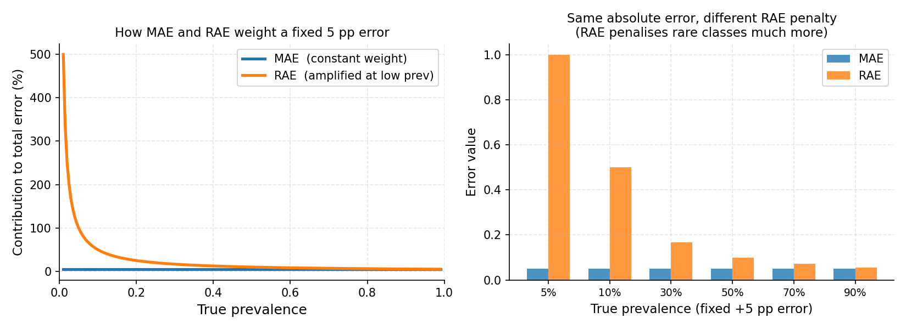

.. _evaluation_metrics:

.. currentmodule:: mlquantify.metrics

==================
Evaluation Metrics
==================

Quantification metrics measure the discrepancy between the estimated
prevalence vector :math:`\hat{p}` and the true prevalence vector :math:`p`.
Unlike classification metrics, they operate on **aggregate probability
vectors** — not on individual predictions.

All metrics in ``mlquantify`` follow the same calling convention:

.. code-block:: python

   error = MetricName(true_prevalences, predicted_prevalences)

Both arguments can be:

- A flat array of true class labels (``y_true``), or
- A prevalence dict/array returned by ``quantifier.predict(X)``.

``mlquantify`` automatically converts true labels to prevalences using
:func:`~mlquantify.utils.get_prev_from_labels` when needed.

.. contents:: Contents
   :local:
   :depth: 2

----

Absolute Error Metrics
=======================

AE and MAE — (Mean) Absolute Error
------------------------------------

.. math::

   \text{AE}(p, \hat{p}) = \frac{1}{|\mathcal{Y}|}
       \sum_{c \in \mathcal{Y}} |p(c) - \hat{p}(c)|

:func:`AE` computes the mean absolute difference per class over a *single*
sample. :func:`MAE` averages AE over *multiple* samples (from a protocol).

**When to use:** MAE is the standard metric for quantification evaluation.
It is interpretable (the average error in prevalence units, e.g. 0.05 means
"off by 5 percentage points on average"), symmetric, and gives equal weight
to all classes and prevalence levels.

   *Left: for a fixed 5 percentage-point absolute error, MAE assigns equal weight
   regardless of the true prevalence (flat blue line), while RAE's contribution
   grows steeply as prevalence approaches zero (orange curve).
   Right: the same 5 pp absolute error applied at different prevalence levels
   — RAE imposes a much heavier penalty at 5% and 10% prevalence, reflecting
   that a 5 pp error is far more significant when the true value is 5% than 50%.*

.. code-block:: python

   from mlquantify.metrics import MAE, AE
   from mlquantify.utils import get_prev_from_labels
   import numpy as np

   y_true  = np.array([0, 0, 1, 0, 1, 1, 0, 0, 0, 1])
   y_pred  = {0: 0.62, 1: 0.38}

   true_prev = get_prev_from_labels(y_true)
   print(AE(true_prev, y_pred))   # single-sample AE
   # 0.02

   # Over multiple protocol samples
   errors = [AE(get_prev_from_labels(y_s), q.predict(X_s))
             for X_s, y_s in samples]
   print(MAE(errors))             # mean over all samples

SE and MSE — (Mean) Squared Error
-----------------------------------

.. math::

   \text{SE}(p, \hat{p}) = \frac{1}{|\mathcal{Y}|}
       \sum_{c \in \mathcal{Y}} (p(c) - \hat{p}(c))^2

:func:`SE` penalises large errors more severely than AE (quadratic vs
linear). Use MSE when large deviations are especially harmful.

.. code-block:: python

   from mlquantify.metrics import MSE
   print(MSE(true_prev, y_pred))

----

Relative Error Metrics
=======================

RAE and NRAE — (Normalised) Relative Absolute Error
-----------------------------------------------------

.. math::

   \text{RAE}(p, \hat{p}) = \frac{1}{|\mathcal{Y}|}
       \sum_{c \in \mathcal{Y}} \frac{|p(c) - \hat{p}(c)|}{p(c) + \varepsilon}

where :math:`\varepsilon` is a small smoothing constant.

**When to use:** RAE amplifies errors at *low prevalences*. An error of 5
percentage points matters much more at 5% prevalence than at 50%. Use RAE
when rare classes are important (e.g. rare disease detection, fraud
detection).

:func:`NRAE` normalises RAE to :math:`[0, 1]` so it is comparable across
datasets with different numbers of classes.

.. code-block:: python

   from mlquantify.metrics import RAE, NRAE

   print(RAE(true_prev, y_pred))
   print(NRAE(true_prev, y_pred))

NAE — Normalised Absolute Error
--------------------------------

:func:`NAE` normalises AE by the number of classes so results are comparable
across different multiclass settings.

----

Divergence Metrics
==================

KLD and NKLD — (Normalised) Kullback-Leibler Divergence
---------------------------------------------------------

.. math::

   \text{KLD}(p, \hat{p}) = \sum_{c \in \mathcal{Y}} p(c) \log\frac{p(c)}{\hat{p}(c)}

KLD measures the *information loss* when using :math:`\hat{p}` to
approximate :math:`p`. It penalises zero-probability predictions
asymptotically (use the smoothed version internally).

**When to use:** KLD is used when prevalences represent probability
distributions and you care about calibration. It is asymmetric — the true
and estimated distributions are not interchangeable — so the convention
matters (``KLD(true, pred)``). :func:`NKLD` normalises to :math:`[0, 1]`.

.. code-block:: python

   from mlquantify.metrics import KLD, NKLD

   print(KLD(true_prev, y_pred))
   print(NKLD(true_prev, y_pred))

----

Ordinal Metrics
================

NMD — Normalised Match Distance
---------------------------------

:func:`NMD` is designed for **ordinal** quantification tasks where classes
have a natural order (e.g. severity levels: mild < moderate < severe). It
measures the earth-mover distance between the CDFs of :math:`p` and
:math:`\hat{p}`.

**When to use:** Use NMD when your classes are ordered and the distance
between adjacent classes matters. For non-ordinal problems, AE or KLD are
more appropriate.

.. code-block:: python

   from mlquantify.metrics import NMD

   # Ordinal classes: 0 < 1 < 2
   true_prev = [0.5, 0.3, 0.2]
   pred_prev = [0.4, 0.4, 0.2]
   print(NMD(true_prev, pred_prev))

RNOD — Relative Normalised Order Distance
------------------------------------------

:func:`RNOD` is a relative version of NMD that amplifies errors at low
prevalences — analogous to RAE for ordinal settings.

----

Distribution Distance Metrics
===============================

The following functions also serve as loss functions in distribution-matching
quantifiers:

.. list-table::
   :widths: 20 80
   :header-rows: 1

   * - Function
     - Description
   * - :func:`hellinger`
     - Hellinger distance between two distributions. :math:`\in [0, 1]`.
   * - :func:`topsoe`
     - TopSoe (Jensen-Shannon-like) divergence.
   * - :func:`probsymm`
     - Probabilistic symmetric chi-squared divergence.
   * - :func:`sqEuclidean`
     - Squared Euclidean distance.

These are available both in standard numpy and JAX-compatible variants
(``hellinger_jax``, etc.) for gradient-based optimisation.

----

Choosing a Metric
=================

.. list-table::
   :widths: 15 85
   :header-rows: 1

   * - Metric
     - Use when
   * - **MAE**
     - Default. Most papers report MAE. Easy to interpret.
   * - **RAE**
     - Rare classes matter; you want errors at low prevalences amplified.
   * - **KLD / NKLD**
     - Probabilistic calibration of the prevalence vector matters.
   * - **MSE**
     - Large estimation errors are especially harmful.
   * - **NMD**
     - Classes have a natural order (ordinal quantification).
   * - **NRAE / NAE / NKLD**
     - Comparing results across datasets with different class counts.

**Full evaluation example:**

.. code-block:: python

   from mlquantify.model_selection import APP
   from mlquantify.metrics import MAE, RAE, NKLD
   from mlquantify.utils import get_prev_from_labels
   from mlquantify.likelihood import EMQ
   from sklearn.linear_model import LogisticRegression
   from sklearn.datasets import make_classification
   from sklearn.model_selection import train_test_split
   import numpy as np

   X, y = make_classification(n_samples=2000, weights=[0.8, 0.2],
                              random_state=42)
   X_train, X_test, y_train, y_test = train_test_split(
       X, y, test_size=0.5, random_state=42)

   q = EMQ(LogisticRegression())
   q.fit(X_train, y_train)

   protocol = APP(batch_size=100, n_prevalences=21, repeats=10,
                  random_state=42)

   maes, raes, nklds = [], [], []
   for idx in protocol.split(X_test, y_test):
       X_s, y_s = X_test[idx], y_test[idx]
       tp = get_prev_from_labels(y_s)
       pp = q.predict(X_s)
       maes.append(MAE(tp, pp))
       raes.append(RAE(tp, pp))
       nklds.append(NKLD(tp, pp))

   print(f"MAE:  {np.mean(maes):.4f}")
   print(f"RAE:  {np.mean(raes):.4f}")
   print(f"NKLD: {np.mean(nklds):.4f}")

.. currentmodule:: mlquantify.metrics

Evaluation metrics for quantification assess the accuracy of estimated class prevalences against true prevalences. These metrics are crucial for understanding how well a quantifier performs, especially under distributional shifts.

The library includes several widely used evaluation metrics:

.. list-table:: Metrics
   :header-rows: 1
   :widths: 30 70

   * - Metric
     - Description
   * - :class:`NMD`
     - Normalized Match Distance
   * - :class:`RNOD`
     - Relative Normalized Overall Deviation
   * - :class:`VSE`
     - Variance Shift Error
   * - :class:`CvM_L1`
     - Cramér-von Mises L1 Distance
   * - :class:`AE`
     - Absolute Error
   * - :class:`SE`
     - Squared Error
   * - :class:`MAE`
     - Mean Absolute Error
   * - :class:`MSE`
     - Mean Squared Error
   * - :class:`KLD`
     - Kullback-Leibler Divergence
   * - :class:`RAE`
     - Relative Absolute Error
   * - :class:`NAE`
     - Normalized Absolute Error
   * - :class:`NRAE`
     - Normalized Relative Absolute Error
   * - :class:`NKLD`
     - Normalized Kullback-Leibler Divergence

=========================================
Single Label Quantification (SLQ) Metrics
=========================================

AE (Absolute Error)
===================

**Parameters:**  

- :math:`p`: array-like, shape (n_classes,)  
  True prevalence (distribution of classes).  
- :math:`\hat{p}`: array-like, shape (n_classes,)  
  Estimated prevalence.

AE calculates the simple absolute error across classes:

.. math::

   \text{AE}(p, \hat{p}) = \sum_{c} |p(c) - \hat{p}(c)|

Its primary strength is transparency and ease of interpretation.

SE (Squared Error)
==================

**Parameters:**

- :math:`p`: array-like, shape (n_classes,)  
  True prevalence.  
- :math:`\hat{p}`: array-like, shape (n_classes,)  
  Estimated prevalence.

SE is the sum of squared differences:

.. math::

   \text{SE}(p, \hat{p}) = \sum_{c} (p(c) - \hat{p}(c))^2

This penalizes larger errors more heavily, making outlier mistakes more obvious.

MAE (Mean Absolute Error)
=========================

**Parameters:**

- :math:`p`: array-like, shape (n_classes,)  
  True prevalence.  
- :math:`\hat{p}`: array-like, shape (n_classes,)  
  Estimated prevalence.

MAE averages the absolute errors over all classes:

.. math::

   \text{MAE}(p, \hat{p}) = \frac{1}{K} \sum_{c} |p(c) - \hat{p}(c)|

It offers a normalized perspective, useful for comparing performances across datasets.

MSE (Mean Squared Error)
========================

**Parameters:**  

- :math:`p`: array-like, shape (n_classes,)  
  True prevalence.  
- :math:`\hat{p}`: array-like, shape (n_classes,)  
  Estimated prevalence.

MSE averages the squared errors:

.. math::

   \text{MSE}(p, \hat{p}) = \frac{1}{K} \sum_{c} (p(c) - \hat{p}(c))^2

Ideal for highlighting large deviations in prevalence estimation.

KLD (Kullback-Leibler Divergence)
=================================

**Parameters:** 

- :math:`p`: array-like, shape (n_classes,)  
  True prevalence.  
- :math:`\hat{p}`: array-like, shape (n_classes,)  
  Estimated prevalence.

KLD measures the information loss between distributions:

.. math::

   \text{KLD}(p, \hat{p}) = \sum_{c} p(c) \log \frac{p(c)}{\hat{p}(c)}

Its key advantage is sensitivity to wrong predictions where the true prevalence is high.

RAE (Relative Absolute Error)
=============================

**Parameters:**  

- :math:`p`: array-like, shape (n_classes,)  
  True prevalence.  
- :math:`\hat{p}`: array-like, shape (n_classes,)  
  Estimated prevalence.  
- :math:`\epsilon`: float, optional (default=1e-12)  
  Small constant to ensure numerical stability.

RAE scales the absolute error by true prevalence:

.. math::

   \text{RAE}(p, \hat{p}) = \sum_{c} \frac{|p(c) - \hat{p}(c)|}{p(c) + \epsilon}

This is beneficial for identifying relative impact in imbalanced scenarios.

NAE (Normalized Absolute Error)
===============================

**Parameters:**

- :math:`p`: array-like, shape (n_classes,)  
  True prevalence.  
- :math:`\hat{p}`: array-like, shape (n_classes,)  
  Estimated prevalence.

NAE normalizes the absolute error:

.. math::

   \text{NAE}(p, \hat{p}) = \frac{1}{K} \sum_{c} \frac{|p(c) - \hat{p}(c)|}{\max\{p(c), \hat{p}(c)\}}

Best used for ensuring error scale invariance.

NRAE (Normalized Relative Absolute Error)
=========================================

**Parameters:**

- :math:`p`: array-like, shape (n_classes,)  
  True prevalence.  
- :math:`\hat{p}`: array-like, shape (n_classes,)  
  Estimated prevalence.  
- :math:`\epsilon`: float, optional (default=1e-12)  
  Small constant for numerical stability.

NRAE further normalizes relative errors:

.. math::

   \text{NRAE}(p, \hat{p}) = \frac{1}{K} \sum_{c} \frac{|p(c) - \hat{p}(c)|}{p(c) + \hat{p}(c) + \epsilon}

This balances error measurement between true and estimated values.

NKLD (Normalized Kullback-Leibler Divergence)
=============================================

**Parameters:** 

- :math:`p`: array-like, shape (n_classes,)  
  True prevalence.  
- :math:`\hat{p}`: array-like, shape (n_classes,)  
  Estimated prevalence.  
- :math:`\epsilon`: float, optional (default=1e-12)
  Small constant for numerical stability.

NKLD outputs a normalized form of KLD:

.. math::

   \text{NKLD}(p, \hat{p}) = \frac{1}{K} \sum_{c} p(c) \log \frac{p(c)}{\hat{p}(c) + \epsilon}

This makes it robust for comparing across distinct sample sizes.

============================================
Regression-Based Quantification (RQ) Metrics
============================================

VSE (Variance Shift Error)
==========================

**Parameters:** 

- :math:`p`: array-like, shape (n_classes,)  
  True prevalence.  
- :math:`\hat{p}`: array-like, shape (n_classes,)  
  Estimated prevalence.

The Variance Shift Error quantifies the discrepancy between the variance of true and estimated distributions:

.. math::

   \text{VSE}(p, \hat{p}) = |\text{Var}(p) - \text{Var}(\hat{p})|

This metric emphasizes changes in dispersion, which is useful for detecting model bias towards certain classes.

CvM_L1 (Cramér-von Mises L1 Distance)
=====================================

**Parameters:**  

- :math:`p`: array-like, shape (n_classes,)  
  True prevalence.  
- :math:`\hat{p}`: array-like, shape (n_classes,)  
  Estimated prevalence.

CvM_L1 compares cumulative distributions using the L1 norm:

.. math::

   \text{CvM\_L1}(p, \hat{p}) = \sum_{c} |F_p(c) - F_{\hat{p}}(c)|

where \(F_p(c)\) is the cumulative distribution. Its advantage lies in capturing distributional differences beyond pointwise errors.

===================================
Ordinal Quantification (OQ) Metrics
===================================

NMD (Normalized Match Distance)
===============================

**Parameters:**  

- :math:`p`: array-like, shape (n_classes,)  
  True prevalence.  
- :math:`\hat{p}`: array-like, shape (n_classes,)  
  Estimated prevalence.

The NMD metric quantifies the normalized difference between two prevalence distributions:

.. math::

   \text{NMD}(p, \hat{p}) = \frac{1}{2} \sum_{c} |p(c) - \hat{p}(c)|

where \( p(c) \) is the true prevalence and \( \hat{p}(c) \) is the estimated. The advantage of NMD is its straightforward interpretability and normalization, making it ideal for comparing different quantification methods.

RNOD (Relative Normalized Overall Deviation)
============================================

**Parameters:**

- :math:`p`: array-like, shape (n_classes,)  
  True prevalence.  
- :math:`\hat{p}`: array-like, shape (n_classes,)  
  Estimated prevalence.  
- :math:`\epsilon`: float, optional (default=1e-12)  
  Small constant to ensure numerical stability.

RNOD measures the proportional deviation between the true and estimated prevalence, particularly highlighting errors in rare classes:

.. math::

   \text{RNOD}(p, \hat{p}) = \frac{1}{K} \sum_{c} \frac{|p(c) - \hat{p}(c)|}{p(c) + \epsilon}

Its benefit is in handling imbalanced distributions by reducing the influence of dominant classes.
