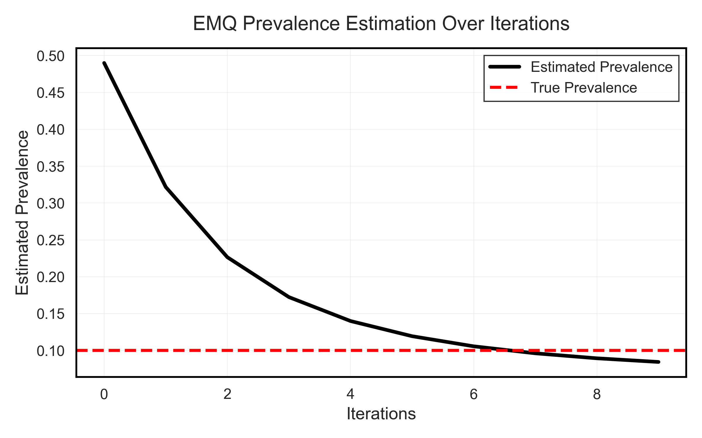

.. _likelihood:

.. currentmodule:: mlquantify.likelihood

===============================
Likelihood-Based Quantification
===============================

Likelihood-based methods estimate class prevalences by maximising the
likelihood of the observed posterior probabilities under the assumption of
**prior probability shift** — the feature distributions within each class do
not change, only the class proportions do.

They are among the most accurate single-model quantifiers and should be your
first upgrade from the counting family.

.. contents:: Contents
   :local:
   :depth: 2

----

Prior Probability Shift — The Core Assumption
==============================================

All methods on this page assume:

.. math::

   P_U(x \mid y) = P_L(x \mid y) \quad \text{but} \quad P_U(y) \neq P_L(y).

Under this assumption, the classifier's posterior probability for a test
instance :math:`x` is distorted by the wrong priors baked in at training time.
Bayes' theorem tells us how to correct it:

.. math::

   P_U(y \mid x) = \frac{P_U(y)}{P_L(y)} \cdot P_L(y \mid x) \cdot Z^{-1}

where :math:`Z` is a normalisation constant. Likelihood-based methods iterate
this correction together with updating :math:`P_U(y)` until convergence.

----

MLPE — Maximum Likelihood Prevalence Estimation (trivial baseline)
====================================================================

:class:`MLPE` is the trivial likelihood baseline: it simply returns the
training-set prevalence as the estimate for any test set, assuming no shift.

.. math::

   \hat{p}^{MLPE}(c) = p_L(c) = \frac{|\{i : y_i = c\}|}{n}

**Why it exists:** MLPE provides the lower bound of what a method should
achieve. If your quantifier cannot beat MLPE, something is wrong. It is also
the **starting point of EMQ** (see below).

.. code-block:: python

   from mlquantify.likelihood import MLPE
   from sklearn.linear_model import LogisticRegression

   q = MLPE(LogisticRegression())
   q.fit(X_train, y_train)
   print(q.predict(X_test))
   # Returns training prevalence regardless of X_test

----

EMQ — Expectation-Maximization Quantifier (SLD)
================================================

:class:`EMQ` (also known as *SLD* for Saerens–Latinne–Decaestecker) is the
most important single quantifier in ``mlquantify``. It iteratively adjusts
posterior probabilities to find the class prevalences that maximise the
likelihood of the observed test data.

The algorithm has two alternating steps:

**E-step** — correct each posterior using the current prevalence estimate:

.. math::

   P^{(s)}(y \mid x_k) = \frac
       {\hat{p}^{(s)}(y) \cdot P_L(y \mid x_k) / p_L(y)}
       {\sum_{y'} \hat{p}^{(s)}(y') \cdot P_L(y' \mid x_k) / p_L(y')}

**M-step** — update the prevalence estimate as the mean of corrected
posteriors:

.. math::

   \hat{p}^{(s+1)}(y) = \frac{1}{|U|} \sum_{x_k \in U} P^{(s)}(y \mid x_k)

Starting from :math:`\hat{p}^{(0)} = p_L` (MLPE), EMQ converges to the
maximum-likelihood prevalence estimate. (Saerens et al., 2002;
Alexandari et al., 2020)

**Why it excels:** EMQ corrects for the exact form of distortion caused by
prior probability shift. Esuli et al. (2023) show it is consistently among
the top performers across benchmarks when the shift assumption holds.

Parameters
----------

.. list-table::
   :widths: 22 15 63
   :header-rows: 1

   * - Parameter
     - Default
     - Explanation
   * - ``estimator``
     - ``None``
     - A probabilistic classifier with ``predict_proba``. Logistic Regression
       is a strong default — it is well-calibrated and fast. Tree-based
       classifiers benefit from probability calibration (e.g. wrap with
       ``CalibratedClassifierCV``) before passing to EMQ.
   * - ``tol``
     - ``1e-4``
     - Convergence threshold. The algorithm stops when the MAE between
       successive prevalence estimates falls below this value. The default
       balances speed and accuracy. Reduce to ``1e-6`` for precision-critical
       applications.
   * - ``max_iter``
     - ``100``
     - Maximum EM iterations. Almost always converges in < 20 iterations.
       Raise to 500 if you see convergence warnings.
   * - ``calib_function``
     - ``None``
     - Optional calibration applied to posteriors **before** the EM loop.
       Calibration corrects overconfident or underconfident probability
       outputs, which can significantly improve EMQ accuracy. Options:

       - ``None`` — skip calibration (use if your classifier is already
         calibrated, e.g. Logistic Regression).
       - ``'ts'`` — Temperature Scaling: a single scalar applied to all logits.
         Good for overconfident models.
       - ``'bcts'`` — Bias-Corrected Temperature Scaling: recommended for most
         neural networks. Alexandari et al. (2020) show this variant achieves
         state-of-the-art label-shift adaptation.
       - ``'vs'`` — Vector Scaling: per-class scaling. More expressive than TS.
       - ``'nbvs'`` — No-Bias Vector Scaling: a middle ground.
   * - ``on_calib_error``
     - ``'backup'``
     - What to do if calibration fails (e.g. due to numerical issues).
       ``'backup'`` silently falls back to uncalibrated posteriors.
       ``'raise'`` propagates the exception so you can investigate.
   * - ``criteria``
     - ``MAE``
     - Convergence criterion comparing successive prevalence estimates. The
       default MAE is appropriate for all problem types.

Examples
--------

Basic usage with Logistic Regression (recommended):

.. code-block:: python

   from mlquantify.likelihood import EMQ
   from sklearn.linear_model import LogisticRegression
   from sklearn.datasets import make_classification
   from sklearn.model_selection import train_test_split

   X, y = make_classification(n_samples=1000, weights=[0.8, 0.2],
                              random_state=42)
   X_train, X_test, y_train, y_test = train_test_split(
       X, y, test_size=0.3, random_state=42)

   q = EMQ(LogisticRegression())
   q.fit(X_train, y_train)
   print(q.predict(X_test))
   # {0: 0.80, 1: 0.20}

With BCTS calibration (best for neural/overconfident classifiers):

.. code-block:: python

   from mlquantify.likelihood import EMQ
   from sklearn.neural_network import MLPClassifier

   q = EMQ(MLPClassifier(hidden_layer_sizes=(100,), max_iter=500),
           calib_function='bcts')
   q.fit(X_train, y_train)
   print(q.predict(X_test))

Using :meth:`aggregate` directly with pre-computed posteriors:

.. code-block:: python

   import numpy as np
   from mlquantify.likelihood import EMQ
   from sklearn.linear_model import LogisticRegression

   # Fit just the classifier
   clf = LogisticRegression().fit(X_train, y_train)
   proba_train = clf.predict_proba(X_train)
   proba_test  = clf.predict_proba(X_test)

   q = EMQ(clf)
   q.fit(X_train, y_train)

   # aggregate(test_posteriors, train_posteriors, train_labels)
   print(q.aggregate(proba_test, proba_train, y_train))

Multiclass (EMQ is natively multiclass):

.. code-block:: python

   from mlquantify.likelihood import EMQ
   from sklearn.linear_model import LogisticRegression
   from sklearn.datasets import make_classification

   X, y = make_classification(n_samples=800, n_classes=4,
                              n_informative=6, n_redundant=0,
                              random_state=42)
   X_train, X_test = X[:600], X[600:]
   y_train, y_test = y[:600], y[600:]

   q = EMQ(LogisticRegression())
   q.fit(X_train, y_train)
   print(q.predict(X_test))
   # {0: 0.25, 1: 0.25, 2: 0.25, 3: 0.25}

.. tip::

   EMQ with ``calib_function='bcts'`` is the single best-performing method
   in Alexandari et al. (2020)'s large benchmark of label-shift methods. Use
   it as the primary quantifier when prior probability shift is expected.

.. admonition:: When EMQ struggles

   EMQ assumes prior probability shift. If the **features** of a class change
   between training and test (concept drift), or if the class-conditional
   distributions overlap heavily and the classifier is poorly calibrated,
   EMQ's correction can overshoot. In these cases, distribution-matching
   methods like :class:`~mlquantify.matching.DyS` or
   :class:`~mlquantify.matching.KDEyHD` may be more robust.

----

CDE — CDE-Iterate (threshold-adjustment via cost ratios)
==========================================================

:class:`CDE` estimates binary class prevalence by iteratively adjusting the
decision threshold using the ratio of misclassification costs derived from
the training priors and the current prevalence estimate.

At each step, the threshold :math:`\tau` is set such that a false negative
and a false positive have equal expected cost:

.. math::

   \tau^{(s)} = \frac{c_{FP}^{(s)}}{c_{FP}^{(s)} + c_{FN}}

where :math:`c_{FP}` is updated from the current prevalence estimate. The
process repeats until the estimated positive proportion stabilises.

**Why it exists:** CDE was proposed by Barranquero et al. (2015) as an
iterative threshold-selection method that avoids cross-validation entirely.
It is lighter than EMQ (no full posterior re-weighting) and often competitive
with threshold-adjustment methods on binary problems.

**Binary-only** — multiclass via OvR.

Parameters
----------

.. list-table::
   :widths: 22 15 63
   :header-rows: 1

   * - Parameter
     - Default
     - Explanation
   * - ``estimator``
     - ``None``
     - Probabilistic classifier.
   * - ``tol``
     - ``1e-4``
     - Convergence tolerance on the positive prevalence between iterations.
   * - ``max_iter``
     - ``100``
     - Maximum iterations. Typically converges in < 20 steps.
   * - ``init_cfp``
     - ``1.0``
     - Initial false-positive cost. The algorithm starts with equal misclassification
       costs (:math:`c_{FP} = c_{FN} = 1`). Change if you have domain knowledge
       about the true cost ratio.
   * - ``strategy``
     - ``'ovr'``
     - Multiclass decomposition.
   * - ``n_jobs``
     - ``None``
     - Parallel jobs.

Examples
--------

.. code-block:: python

   from mlquantify.likelihood import CDE
   from sklearn.linear_model import LogisticRegression

   q = CDE(LogisticRegression(), tol=1e-5)
   q.fit(X_train, y_train)
   print(q.predict(X_test))
   # {0: 0.80, 1: 0.20}

Using :meth:`aggregate` with pre-computed posteriors:

.. code-block:: python

   clf = LogisticRegression().fit(X_train, y_train)
   proba_test = clf.predict_proba(X_test)

   q = CDE(clf)
   q.fit(X_train, y_train)
   print(q.aggregate(proba_test, train_labels=y_train))

----

Method Comparison
=================

.. list-table::
   :widths: 12 15 15 15 43
   :header-rows: 1

   * - Method
     - Multiclass
     - Needs proba
     - Extra fit cost
     - Best for
   * - MLPE
     - ✓
     - ✓
     - None
     - Baseline; no shift expected.
   * - EMQ
     - ✓
     - ✓
     - None
     - **Prior probability shift; recommended default.**
   * - EMQ+BCTS
     - ✓
     - ✓
     - Calibration
     - Overconfident classifiers (neural nets, forests).
   * - CDE
     - ✗ (OvR)
     - ✓
     - None
     - Binary problems; lightweight alternative to EMQ.

**Practical recommendation:**

- Use **EMQ** as your primary quantifier in most scenarios.
- Add ``calib_function='bcts'`` when your classifier tends to be overconfident.
- Use **CDE** when you want a fast, calibration-free alternative for binary tasks.
- Always compare against **MLPE** to verify your method is actually learning something.

.. seealso::

   :ref:`distribution_matching` for methods that do not rely on the prior-shift
   assumption and can handle more general distributional changes.

Likelihood-based methods (Maximum Likelihood) aim to estimate class prevalences in the test set :math:`U`, assuming that the class distribution (priors) has changed, but the probability densities within each class (:math:`P(X|Y)`) have remained the same (Prior Probability Shift).

Maximum Likelihood Prevalence Estimation (MLPE)
===============================================

The **Maximum Likelihood Prevalence Estimation (MLPE)**, defined in :class:`MLPE`, is the simplest strategy and is considered a trivial starting point or baseline. It naively assumes that the class distribution in the test set (:math:`U`) is the same as in the training set (:math:`L`).

MLPE is not a "true" quantification method but rather a trivial strategy. It simply takes the observed prevalence in the training set and uses it as the estimate for the test set.
If there were no dataset shift (change in distribution), MLPE would be the optimal quantification strategy.

Expectation Maximization for Quantification (EMQ)
=================================================

The **Expectation Maximization for Quantification (EMQ)**, defined in :class:`EMQ` (also known as **SLD** — Saerens, Latinne, Decaestecker) [1]_, is an transductive algorithm that uses a transductive correction of posterior probabilities to estimate class prevalences in the test set :math:`U` by maximizing the likelihood of the observed data [2]_.

The SLD algorithm is based on the Expectation-Maximization (EM) framework, which is an iterative method for finding maximum likelihood estimates in models with latent variables. The :class:`EMQ` works by:

- **Adjusting classifier outputs**: It adjusts the outputs of a probabilistic classifier to correspond to new prior probabilities (prevalences) without the need to retrain the classification model. As a byproduct of this process, it also estimates the new prior probabilities.
- **Iterative refinement**: EMQ is a mutually recursive process that iterates by incrementally updating posterior probabilities (**E-Step**) and then class prevalences (**M-Step**) until the process converges.
- **Convergence guarantee**: The algorithm converges to a global maximum of the likelihood estimate, as the likelihood function is concave and bounded.

   *Expectation Maximization Illustration for a binary scenario (looking only at the positive class)*

The method starts at **Iteration 0**, where the initial estimated prevalence :math:`\hat{p}^{(0)}_U(y)` is defined as the training set prevalence :math:`p_L(y)` (i.e., the MLPE estimate, or priors). From there, EMQ uses iteration to adjust this initial estimate.

.. dropdown:: Mathematical details - EMQ Algorithm

   EMQ iterates between the E and M steps, based on:

   - :math:`\hat{p}^{(s)}_U(\omega_i)`: Estimated prevalence of class :math:`\omega_i` at iteration :math:`s`.
   - :math:`\hat{p}_L(\omega_i)`: Prior probability of class :math:`\omega_i` in the source domain (training).
   - :math:`\hat{p}_L(\omega_i \mid x_k)`: Posterior probability of :math:`x_k` belonging to class :math:`\omega_i`, provided by the calibrated classifier.

   **Initialization (Iteration s=0)**

   For each class :math:`y \in Y`:

   .. math::

      \hat{p}^{(0)}_U(y) \leftarrow p_L(y)

   **E-Step (Expectation) - Posterior Probability Correction**

   Calculates the corrected posterior probability, :math:`p^{(s)}(\omega_i \mid x_k)`. This step adjusts the classifier output probabilities using the ratio between the new estimated prevalence and the training prevalence:

   .. math::

      p^{(s)}(\omega_i \mid x_k) \leftarrow \frac{ \frac{\hat{p}^{(s-1)}_U(\omega_i)}{\hat{p}_L(\omega_i)} \cdot p^{(0)}(\omega_i \mid x_k) }{ \sum_{\omega_j \in Y} \frac{\hat{p}^{(s-1)}_U(\omega_j)}{\hat{p}_L(\omega_j)} \cdot p^{(0)}(\omega_j \mid x_k) }

   **M-Step (Maximization) - Prevalence Update**

   The new prevalence estimate (:math:`\hat{p}^{(s)}_U(\omega_i)`) is the average of the corrected posterior probabilities over all :math:`N` samples in the test set :math:`U`:

   .. math::

      \hat{p}^{(s)}_U(\omega_i) \leftarrow \frac{1}{|U|} \sum_{x_k \in U} p^{(s)}(\omega_i \mid x_k)

   The EMQ iterates the E and M steps until the prevalence parameters converge [1]_ [2]_.

**Example**

.. code-block:: python

   from mlquantify.likelihood import EMQ
   from sklearn.linear_model import LogisticRegression

   # EMQ requires a probabilistic classifier (soft classifier)
   q = EMQ(estimator=LogisticRegression())
   q.fit(X_train, y_train)
   
   # Updates predictions based on the test distribution iteratively
   q.predict(X_test) 
   # -> adjusted prevalence dictionary

.. dropdown:: References

   .. [1] Saerens, M., Latinne, P., & Decaestecker, C. (2002). Adjusting the outputs of a classifier to new a priori probabilities: A simple procedure. Neural computation, 14(1), 21-41.
   .. [2] Esuli, A., Fabris, A., Moreo, A., & Sebastiani, F. (n.d.). Learning to Quantify The Information Retrieval Series.