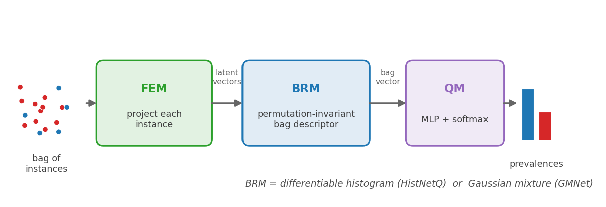

.. _neural_quantifiers:

.. currentmodule:: mlquantify.neural

==================
Neural Quantifiers
==================

Neural quantifiers learn a direct mapping from a *bag of instances* to a
prevalence vector, without relying on a hand-crafted aggregation formula.
They are trained end-to-end to minimise a quantification loss and can
exploit deep feature representations that are inaccessible to analytical
methods.

.. admonition:: PyTorch required

   Neural quantifiers depend on ``torch``. Install it with::

      pip install torch

.. contents:: Contents
   :local:
   :depth: 2

----

QuaNet — Quantification Network
=================================

:class:`QuaNet` (Esuli et al., 2018) is a recurrent neural network that reads
a **set** of instance embeddings produced by a base classifier and predicts
the prevalence vector for that set.

**Architecture:**

1. The base classifier (``estimator``) produces a fixed-size embedding for
   each test instance (via its ``transform`` or ``predict_proba`` output).
2. An LSTM reads the sequence of embeddings (in random order) to produce a
   context vector summarising the set.
3. The context vector is concatenated with *auxiliary quantification statistics*
   (CC, PCC, and ACC estimates) computed on the current batch.
4. A feed-forward head maps the concatenated vector to a prevalence vector
   with a softmax output.

**Why it exists:** QuaNet learns to exploit patterns in instance embeddings
that rule-based aggregation methods cannot capture. On large text datasets
where embeddings carry rich distributional information, it has shown
competitive or superior performance to DyS and EMQ.

Parameters
----------

.. list-table::
   :widths: 22 15 63
   :header-rows: 1

   * - Parameter
     - Default
     - Explanation
   * - ``estimator``
     - required
     - A classifier that (a) produces posterior probabilities via
       ``predict_proba`` and (b) optionally exposes a ``transform`` method for
       dense embeddings. The predictions are used as LSTM inputs.
   * - ``device``
     - ``'cpu'``
     - PyTorch device. Set to ``'cuda'`` to use a GPU if available. Training
       is significantly faster on GPU for large datasets.
   * - ``hidden_size``
     - ``64``
     - Size of the LSTM hidden state. Larger values give more capacity but
       require more data. Try 32, 64, 128 depending on dataset size.
   * - ``n_hidden_layers``
     - ``1``
     - Number of LSTM layers. More layers capture longer-range dependencies in
       the embedding sequence but are slower to train.
   * - ``lstm_hidden_size``
     - ``32``
     - Hidden size per LSTM layer.
   * - ``drop_p``
     - ``0.5``
     - Dropout probability in the feed-forward head. Reduce to 0.2–0.3 if
       training data is large; increase to 0.6–0.7 to combat overfitting on
       small datasets.
   * - ``batch_size``
     - ``64``
     - Number of instances per training mini-batch. Larger batches are faster
       on GPU; smaller batches provide more gradient-update steps per epoch.
   * - ``max_epoch``
     - ``100``
     - Maximum training epochs. Early stopping kicks in if validation loss
       stops improving.
   * - ``patience``
     - ``10``
     - Early-stopping patience (epochs without improvement before stopping).
   * - ``lr``
     - ``1e-3``
     - Adam learning rate. Reduce to ``1e-4`` if training is unstable.
   * - ``val_split``
     - ``0.3``
     - Fraction of training data held out as validation (for early stopping).

Examples
--------

.. code-block:: python

   # Requires PyTorch
   from mlquantify.neural import QuaNet
   from sklearn.linear_model import LogisticRegression
   from sklearn.datasets import make_classification
   from sklearn.model_selection import train_test_split

   X, y = make_classification(n_samples=2000, n_features=20,
                              weights=[0.7, 0.3], random_state=42)
   X_train, X_test, y_train, y_test = train_test_split(
       X, y, test_size=0.3, random_state=42)

   # QuaNet uses the classifier's predict_proba as embedding
   q = QuaNet(
       estimator=LogisticRegression(),
       device='cpu',
       hidden_size=64,
       max_epoch=50,
       patience=5,
   )
   q.fit(X_train, y_train)
   print(q.predict(X_test))

.. note::

   QuaNet needs an estimator that produces **both** posterior probabilities
   (``predict_proba``) and dense embeddings (``transform``). If your classifier
   has no ``transform`` (most scikit-learn classifiers don't), pass a separate
   ``embedder`` — any transformer with a ``transform`` method, e.g.
   :class:`~sklearn.decomposition.PCA`,
   :class:`~sklearn.feature_extraction.text.TfidfVectorizer`, or a
   :class:`TorchClassifierWrapper` (see below):

   .. code-block:: python

      from sklearn.linear_model import LogisticRegression
      from sklearn.decomposition import PCA

      q = QuaNet(
          estimator=LogisticRegression(),   # supplies predict_proba
          embedder=PCA(n_components=32),     # supplies transform (embeddings)
          device='cpu',
      )
      q.fit(X_train, y_train)

   When ``fit_estimator=True`` (the default) both the estimator and a fittable
   ``embedder`` are trained inside :meth:`QuaNet.fit`.

When to Use QuaNet
-------------------

- **Large text datasets** where the base classifier produces rich embeddings
  (e.g. transformer-based models with ``transform``).
- **When EMQ / DyS plateau** and you have enough data and computation to
  train end-to-end.
- **Not recommended** for small datasets (< 1,000 instances) or when
  computation is constrained — analytical methods (EMQ, DyS) will be faster
  and likely more accurate.

.. seealso::

   :ref:`likelihood` for EMQ, which is faster and often competitive.
   :ref:`distribution_matching` for DyS / KDEyML.

----

Symmetric neural quantifiers: HistNetQ and GMNet
================================================

QuaNet is an *asymmetric* method: it leans on a pre-trained classifier and a
set of auxiliary quantifiers, and only the LSTM head is quantification-specific.
:class:`HistNetQ` and :class:`GMNet` take the **symmetric** route instead — they
are trained directly on *bags labelled by prevalence* and minimise a
quantification loss end-to-end, with no intermediate classification step. Both
share the same three-module architecture (Pérez-Mon et al., 2024, 2025):

1. **Feature Extraction Module (FEM)** — a plain ``nn.Module`` you supply that
   maps each instance in a bag to a latent vector.
2. **Bag Representation Module (BRM)** — a *permutation-invariant* layer that
   summarises the whole bag into one fixed-length vector. This is the only part
   that differs between the two methods (a differentiable histogram for
   HistNetQ, a Gaussian mixture for GMNet) and is the heart of the approach.
3. **Quantification Module (QM)** — a small MLP with a softmax output that maps
   the bag representation to a prevalence vector.

   FEM → BRM → QM. Each instance is projected by the FEM; the BRM pools the
   instances into a single permutation-invariant descriptor; the QM reads that
   descriptor and outputs class prevalences.

**How they are trained.** Because the quantity to predict is a *bag* property,
training needs many bags at different prevalences. Both methods generate them
internally with an APP-style sampler that draws a target prevalence uniformly
from the simplex and assembles a bag to match it, so the network sees the whole
prevalence range rather than only the natural training mix. Two ideas from the
papers are built in:

- **Bag Mixer augmentation** (``bag_mixer_ratio``) — new bags are synthesised by
  mixing halves of two existing bags and interpolating their prevalences,
  cheaply enlarging the (otherwise scarce) supply of labelled bags.
- A **quantification loss** chosen with the ``loss`` argument: smoothed relative
  absolute error (``'rae'``, the default), absolute error (``'ae'``), or squared
  error (``'mse'``).

.. admonition:: Permutation invariance

   The BRM must give the *same* output regardless of the order of instances in
   the bag — a bag is a *set*, not a sequence. Both
   :class:`~mlquantify.representations.DifferentiableHistogramRepresentation` and
   :class:`~mlquantify.representations.GaussianRepresentation` achieve this by
   averaging a per-instance quantity over the bag. See :ref:`representations`
   for how each descriptor is computed.

HistNetQ — differentiable histograms
------------------------------------

:class:`HistNetQ` (Pérez-Mon et al., 2024) summarises a bag with a **learnable
histogram per latent feature**. Histograms are the natural tool for counting,
but ordinary histograms are not differentiable; HistNetQ replaces the hard bin
assignment with a differentiable approximation whose bin centers and widths are
learned jointly with the rest of the network.

.. list-table::
   :widths: 24 14 62
   :header-rows: 1

   * - Parameter
     - Default
     - Explanation
   * - ``feature_extractor``
     - required
     - Your FEM ``nn.Module``, returning the **raw** latent vector (no final
       ``nn.Sigmoid()`` — the network squashes it into the histogram's ``[0, 1]``
       range internally). Input features are standardised inside ``fit``, so a
       deep FEM with dropout works well.
   * - ``n_latent_features``
     - required
     - Output width of the FEM — sizes the histogram layer.
   * - ``n_bins``
     - ``32``
     - Bins per latent feature. More bins resolve finer structure but need
       larger bags to fill reliably.
   * - ``ff_layers``
     - ``(512, 256)``
     - Hidden sizes of the QM head.
   * - ``bag_size`` / ``n_bags`` / ``val_bags``
     - ``500`` / ``1000`` / ``300``
     - Examples per training bag, and number of train / validation bags drawn
       per epoch.
   * - ``bag_mixer_ratio``
     - ``0.5``
     - Fraction of training bags replaced by Bag-Mixer-augmented bags.
   * - ``loss``
     - ``'rae'``
     - Quantification loss: ``'rae'``, ``'ae'`` or ``'mse'``.
   * - ``n_epochs`` / ``patience`` / ``lr``
     - ``100`` / ``20`` / ``1e-3``
     - Training budget, patience and initial learning rate.
   * - ``optimizer`` / ``weight_decay``
     - ``'adam'`` / ``0.0``
     - Optimiser (``'adam'`` or ``'adamw'``) and weight-decay regularisation.
   * - ``end_lr`` / ``lr_factor`` / ``gradient_accumulation``
     - ``None`` / ``0.1`` / ``1``
     - Set ``end_lr`` to enable LR scheduling (reduce on a validation plateau by
       ``lr_factor``, stop below ``end_lr``); accumulate gradients over several
       mini-batches. Configuring these like Pérez-Mon et al. — ``optimizer='adamw'``,
       ``weight_decay=1e-5``, ``lr=1e-4``, ``end_lr=1e-5``, ``lr_factor=0.5`` —
       reproduces their training setup.
   * - ``verbose`` / ``checkpoint_path`` / ``checkpoint_every``
     - ``False`` / ``None`` / ``0``
     - Show a ``tqdm`` training progress bar (``verbose``); and periodically save
       a checkpoint (network + optimiser + scheduler + best state) to
       ``checkpoint_path`` every ``checkpoint_every`` epochs. Re-fitting with the
       same ``checkpoint_path`` **resumes** from it, so training can be stopped
       and continued.

.. code-block:: python

   import torch.nn as nn
   from mlquantify.neural import HistNetQ

   # FEM: raw latent output — HistNetQ normalises it into [0, 1] internally
   fem = nn.Sequential(
       nn.Linear(n_features, 64), nn.ReLU(),
       nn.Linear(64, 16),
   )
   q = HistNetQ(feature_extractor=fem, n_latent_features=16,
                n_bins=24, device='cpu')
   q.fit(X_train, y_train)
   q.predict(X_test)            # prevalence vector

A worked, plotted end-to-end run is in the example
:ref:`sphx_neural_quantifiers`.

GMNet — Gaussian latent-space representation
--------------------------------------------

:class:`GMNet` (Pérez-Mon et al., 2025) replaces the histogram with a mixture of
**K learnable full-covariance Gaussians** living in the latent space, replicated
across **L** independent latent spaces. Each instance's multivariate-normal
likelihood under every Gaussian is computed; the K likelihoods are normalised and
averaged over the bag. Because each Gaussian's *full* covariance couples the
latent dimensions, the descriptor captures feature correlations a per-feature
histogram cannot, and it avoids binning entirely. Keep ``latent_dim`` small (the
covariance is ``d × d`` per Gaussian; the paper uses ~3–8).

.. list-table::
   :widths: 24 14 62
   :header-rows: 1

   * - Parameter
     - Default
     - Explanation
   * - ``feature_extractor``
     - required
     - Shared base FEM. A sigmoid projection per latent space is appended
       internally, so the FEM itself need not be bounded.
   * - ``n_input_features``
     - required
     - Input width fed to the FEM.
   * - ``latent_dim`` / ``n_gaussians`` / ``n_latent``
     - ``8`` / ``100`` / ``9``
     - Latent dimensionality *d* (small — full ``d × d`` covariance per Gaussian),
       number of Gaussians *K* per space, and number of independent latent spaces
       *L*. Output size is ``K × L``.
   * - ``cka_lambda``
     - ``0.01``
     - Weight of the CKA diversity penalty that keeps the *L* latent spaces from
       collapsing onto each other. Set ``0.0`` to disable.
   * - ``ff_layers`` / ``loss``
     - ``(512, 256)`` / ``'rae'``
     - QM head sizes and the quantification loss.
   * - ``bag_size`` / ``n_bags`` / ``val_bags``
     - ``1000`` / ``1000`` / ``300``
     - Bag size and number of train / validation bags per epoch.
   * - ``n_epochs`` / ``patience`` / ``lr``
     - ``100`` / ``20`` / ``1e-3``
     - Training budget, patience and initial learning rate.
   * - ``optimizer`` / ``weight_decay``
     - ``'adam'`` / ``0.0``
     - Optimiser (``'adam'`` or ``'adamw'``) and weight-decay regularisation.
   * - ``end_lr`` / ``lr_factor`` / ``gradient_accumulation``
     - ``None`` / ``0.1`` / ``1``
     - Set ``end_lr`` to enable LR scheduling (reduce on a validation plateau by
       ``lr_factor``, stop below ``end_lr``); accumulate gradients over several
       mini-batches. Configuring these like Pérez-Mon et al. — ``optimizer='adamw'``,
       ``weight_decay=1e-5``, ``lr=1e-4``, ``end_lr=1e-5``, ``lr_factor=0.5`` —
       reproduces their training setup.
   * - ``verbose`` / ``checkpoint_path`` / ``checkpoint_every``
     - ``False`` / ``None`` / ``0``
     - Show a ``tqdm`` training progress bar (``verbose``); and periodically save
       a checkpoint (network + optimiser + scheduler + best state) to
       ``checkpoint_path`` every ``checkpoint_every`` epochs. Re-fitting with the
       same ``checkpoint_path`` **resumes** from it, so training can be stopped
       and continued.

.. code-block:: python

   import torch.nn as nn
   from mlquantify.neural import GMNet

   fem = nn.Sequential(nn.Linear(n_features, 64), nn.ReLU())
   q = GMNet(feature_extractor=fem, n_input_features=n_features,
             latent_dim=16, n_gaussians=32, n_latent=4, device='cpu')
   q.fit(X_train, y_train)
   q.predict(X_test)

When to use which
-----------------

- **HistNetQ** — interpretable, light, and a strong default; the per-feature
  histogram works well when the discriminative signal lives in individual
  latent dimensions.
- **GMNet** — reach for it when features interact and a per-feature summary
  loses too much; the joint Gaussians and multiple latent spaces give a richer
  (but heavier) representation.
- Both, like QuaNet, want **enough labelled data** and a few hundred bags per
  epoch to train well; on small problems the analytical methods (EMQ, DyS) are
  faster and usually as accurate.

.. seealso::

   :ref:`representations` — the differentiable histogram and Gaussian BRMs in
   detail. :ref:`sphx_neural_quantifiers` — a plotted comparison on synthetic
   data.

Training directly on labelled bags
----------------------------------

``HistNetQ`` and ``GMNet`` normally take individually labelled data ``fit(X, y)``
and compose artificial bags from it (APP). Sometimes, though, the training data
is *already* a set of bags, each labelled only by its **class prevalence** and
with no per-instance labels — this is the native format of the LeQua competitions
and, more generally, of *learning from label proportions*.

:class:`HistNetQBags` and :class:`GMNetBags` (the same networks combined with
:class:`PrevalenceBagMixin`) consume exactly that, via ``fit(Xs, ps)``:

.. code-block:: python

   import torch.nn as nn
   from mlquantify.neural import HistNetQBags

   # Xs: a list of bags, each (n_examples, n_features)  (or one 3-D array)
   # ps: (n_bags, n_classes) prevalence label of each bag
   fem = nn.Sequential(nn.Linear(n_features, 512), nn.ReLU(), nn.Linear(512, 64))
   q = HistNetQBags(feature_extractor=fem, n_latent_features=64,
                    bag_size=250, device='cpu')
   q.fit(Xs, ps)          # no per-instance labels needed
   q.predict(test_bag)    # prevalence vector, same as HistNetQ

New training bags are synthesised by mixing the real ones (Bag Mixer,
``bag_mixer_ratio``). All bags must share a size so they can be stacked into
mini-batches; pass ``bag_size`` to subsample bags of differing length to a common
size. ``predict`` is identical to the parent quantifier. To turn any custom
symmetric quantifier into a bag-trained one, mix in :class:`PrevalenceBagMixin`
yourself (``class MyQBags(PrevalenceBagMixin, MyQ): ...``).

----

TorchClassifierWrapper — using a PyTorch model as the estimator
===============================================================

:class:`TorchClassifierWrapper` adapts any ``torch.nn.Module`` to the
scikit-learn estimator interface (``fit`` / ``predict_proba`` / ``transform``)
so it can be dropped into :class:`QuaNet` (or any aggregative quantifier that
needs posteriors). Point ``encoder_attr`` at a sub-module to expose its output
as the embedding returned by ``transform``:

.. code-block:: python

   import torch.nn as nn
   from mlquantify.neural import QuaNet, TorchClassifierWrapper

   class Net(nn.Module):
       def __init__(self):
           super().__init__()
           self.encoder = nn.Sequential(nn.Linear(512, 128), nn.ReLU())
           self.head    = nn.Linear(128, 2)
       def forward(self, x):
           return self.head(self.encoder(x))

   clf = TorchClassifierWrapper(Net(), encoder_attr='encoder', n_epochs=20)
   clf.fit(X_train, y_train)
   clf.predict_proba(X_test)    # (n, 2) posteriors  — via head + softmax
   clf.transform(X_test)        # (n, 128) embeddings — via encoder

   # plug straight into QuaNet (one object supplies both posteriors and embeddings)
   q = QuaNet(estimator=clf, fit_estimator=False, device='cpu')
   q.fit(X_train, y_train)

References
==========

.. dropdown:: References

   - Esuli, A., Moreo, A., & Sebastiani, F. (2018). A Recurrent Neural Network
     for Sentiment Quantification. *CIKM*, 1775–1778. (QuaNet)
   - Pérez-Mon, O., Moreo, A., del Coz, J. J., & González, P. (2024).
     Quantification using permutation-invariant networks based on histograms.
     *Neural Computing and Applications*, 37, 3505–3520. (HistNetQ)
   - Pérez-Mon, O., del Coz, J. J., & González, P. (2025). Quantification Via
     Gaussian Latent Space Representations. *arXiv:2501.13638*. (GMNet)

