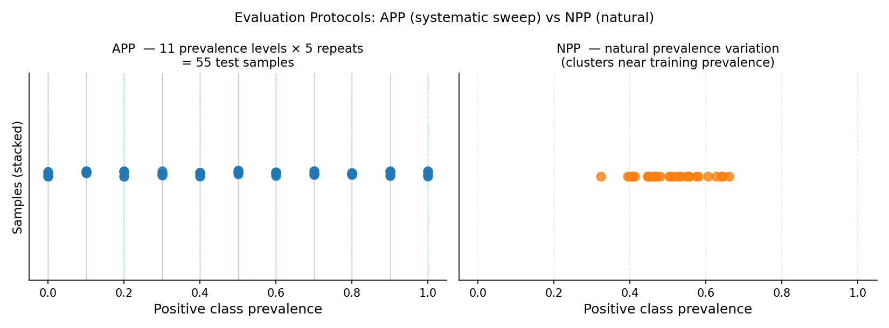

.. _quantification_protocols:

.. currentmodule:: mlquantify.model_selection

==============================
Protocols for Quantification
==============================

Evaluating a quantifier on a single test set is misleading — the test
prevalence is fixed, so you only see performance at one operating point.
Quantification protocols address this by generating **many test batches**
with varying prevalences from the same data, giving a fuller picture of
method behaviour across the entire prevalence spectrum.

.. admonition:: Why protocols matter

   A quantifier that looks excellent at 50/50 prevalence may fail badly at
   5/95. Forman (2005) noted that the choice of evaluation protocol is as
   important as the choice of method. Standard practice in quantification
   research is to evaluate across a grid of prevalences (APP) and report the
   mean error over all samples.

.. contents:: Contents
   :local:
   :depth: 2

----

Quick evaluation with ``apply_protocol``
========================================

:func:`apply_protocol` runs the whole evaluation loop in a single call — the
protocol analogue of scikit-learn's
:func:`~sklearn.model_selection.cross_validate`. It fits the quantifier, samples
the test batches with the chosen protocol, predicts each one, and returns the
true and predicted prevalences together with one score array per metric:

.. code-block:: python

   from mlquantify.model_selection import apply_protocol
   from mlquantify.likelihood import EMQ
   from sklearn.linear_model import LogisticRegression
   from sklearn.datasets import make_classification

   X, y = make_classification(n_samples=2000, weights=[0.7, 0.3], random_state=42)

   results = apply_protocol(
       EMQ(LogisticRegression()), X, y,
       protocol="app",           # 'app' | 'npp' | 'upp' | 'ppp'
       scoring=["mae", "nmd"],   # one metric name, a callable, or a list
       n_prevalences=21,
       batch_size=100,
       test_size=0.5,            # held-out pool the protocol samples from
       random_state=42,
   )

   print("samples:", results["n_batches"])
   print("MAE:", results["MAE"].mean(), "NMD:", results["NMD"].mean())
   # results["true_prevalences"], results["predicted_prevalences"] -> (n_samples, n_classes)

By default a copy of the quantifier is trained on ``1 - test_size`` of the data
and evaluated on the rest. Pass ``fit=False`` to evaluate an already-fitted
quantifier, ``return_estimator=True`` to get the trained model back, or a
:class:`BaseProtocol` instance as ``protocol`` for full control. The sections
below document the underlying protocols, which you can also drive manually.

----

APP — Artificial Prevalence Protocol
======================================

:class:`APP` is the most widely used evaluation protocol. By default it draws
samples from the test set at each prevalence in a uniform grid
:math:`\{0, \frac{1}{n-1}, \frac{2}{n-1}, \ldots, 1\}` for the positive
class, repeating each prevalence ``repeats`` times.

**Why it is standard:** APP ensures every method is evaluated at many
prevalence values, not just the natural one. It exposes systematic biases
(e.g. methods that only work near 50/50) and gives a fair cross-method
comparison. González et al. (2017) review papers routinely use APP as the
evaluation backbone.

**Choosing how prevalences are produced.** The ``strategy`` parameter selects
how the prevalence vectors are drawn over the simplex. ``'grid'`` is the
classic systematic sweep; the other strategies *sample* the simplex and scale
to many classes without the grid's combinatorial blow-up. :class:`UPP` is
simply ``APP`` with a sampling strategy pinned on.

Parameters
----------

.. list-table::
   :widths: 22 15 63
   :header-rows: 1

   * - Parameter
     - Default
     - Explanation
   * - ``batch_size``
     - required
     - Number of instances per test sample. Larger batches give more stable
       prevalence estimates but require a larger test set. A typical choice is
       100–500.
   * - ``n_prevalences``
     - ``21``
     - Number of equally-spaced prevalence points from ``min_prev`` to
       ``max_prev``. ``21`` gives a step of 0.05 (i.e. 0%, 5%, 10%, …, 100%).
   * - ``repeats``
     - ``10``
     - How many independent samples to draw at each prevalence level. More
       repeats reduce variance in the average error estimate. Use ≥ 5 for
       reliable results.
   * - ``min_prev``
     - ``0.0``
     - Minimum positive class prevalence in the grid. Leave at 0 to include
       the all-negative case.
   * - ``max_prev``
     - ``1.0``
     - Maximum positive class prevalence. Leave at 1 to include the
       all-positive case.
   * - ``strategy``
     - ``'grid'``
     - How prevalence vectors are generated over the simplex:

       - ``'grid'`` — a regular lattice of evenly-spaced prevalences from
         ``min_prev`` to ``max_prev`` (the classic APP). Deterministic and
         systematic, but the number of points grows combinatorially
         (:math:`O(n^{k-1})` for ``k`` classes), so it is best for binary or
         low-class-count problems.
       - ``'kraemer'`` — the Kraemer method for *uniform* sampling over the
         simplex. Every prevalence combination is equally likely and the cost
         is independent of the number of classes, ideal for multiclass.
       - ``'uniform'`` — uniform sampling via the flat Dirichlet
         :math:`\mathrm{Dir}(\mathbf{1})`. Statistically equivalent to
         ``'kraemer'`` but produced through the Dirichlet route; it is exactly
         ``'dirichlet'`` with ``dirichlet_alpha=1``.
       - ``'dirichlet'`` — sampling from a Dirichlet whose concentration is set
         by ``dirichlet_alpha``, letting you *bias* the prevalences (see below).
   * - ``dirichlet_alpha``
     - ``1.0``
     - Concentration for ``strategy='dirichlet'``. A scalar is broadcast to a
       symmetric Dirichlet; an array of length ``n_classes`` sets a per-class
       concentration. ``alpha > 1`` favours balanced prevalences near the
       centre of the simplex; ``alpha < 1`` favours extreme,
       one-class-dominant prevalences near the corners; ``alpha = 1`` is
       uniform. Ignored by the other strategies.
   * - ``random_state``
     - ``None``
     - Seed for reproducible sampling.

   *Left: APP generates test samples at every point on a regular prevalence grid
   (blue dots), giving systematic coverage from 0% to 100% positive class.
   Right: NPP draws random sub-samples that cluster near the natural training
   prevalence (~50%), providing realistic but narrower coverage.*

Examples
--------

Standard evaluation loop:

.. code-block:: python

   from mlquantify.model_selection import APP
   from mlquantify.metrics import MAE
   from mlquantify.utils import get_prev_from_labels
   from mlquantify.likelihood import EMQ
   from sklearn.linear_model import LogisticRegression
   from sklearn.datasets import make_classification
   from sklearn.model_selection import train_test_split
   import numpy as np

   X, y = make_classification(n_samples=2000, weights=[0.7, 0.3],
                              random_state=42)
   X_train, X_test, y_train, y_test = train_test_split(
       X, y, test_size=0.5, random_state=42)

   q = EMQ(LogisticRegression())
   q.fit(X_train, y_train)

   protocol = APP(batch_size=100, n_prevalences=21, repeats=10,
                  random_state=42)
   errors = []
   for idx in protocol.split(X_test, y_test):
       X_sample, y_sample = X_test[idx], y_test[idx]
       true_prev = get_prev_from_labels(y_sample)
       pred_prev = q.predict(X_sample)
       errors.append(MAE(true_prev, pred_prev))

   print(f"Mean MAE over {len(errors)} samples: {np.mean(errors):.4f}")

Comparing multiple quantifiers:

.. code-block:: python

   from mlquantify.counting import CC, PCC
   from mlquantify.likelihood import EMQ
   from mlquantify.matching import DyS
   from sklearn.linear_model import LogisticRegression

   quantifiers = {
       'CC':  CC(LogisticRegression()),
       'PCC': PCC(LogisticRegression()),
       'EMQ': EMQ(LogisticRegression()),
       'DyS': DyS(LogisticRegression()),
   }

   for name, q in quantifiers.items():
       q.fit(X_train, y_train)

   protocol = APP(batch_size=100, n_prevalences=21, repeats=10,
                  random_state=42)

   results = {name: [] for name in quantifiers}
   for idx in protocol.split(X_test, y_test):
       X_s, y_s = X_test[idx], y_test[idx]
       true_prev = get_prev_from_labels(y_s)
       for name, q in quantifiers.items():
           results[name].append(MAE(true_prev, q.predict(X_s)))

   for name, errs in results.items():
       print(f"{name:5s}  MAE={np.mean(errs):.4f}")

----

NPP — Natural Prevalence Protocol
===================================

:class:`NPP` draws random sub-samples from the test set without altering
the natural class distribution. Each sample has a slightly different
prevalence due to random variation, but no artificial manipulation is
performed.

**Why it exists:** NPP evaluates quantifiers under *real* prevalence
variation — how they perform when deployed on random sub-populations drawn
from the same underlying distribution as the test set. It is less controlled
than APP but more realistic.

**Limitation:** Because NPP cannot produce extreme prevalences (e.g. 2%
positive) without a very large test set, it gives a narrower view of method
behaviour than APP.

Parameters
----------

.. list-table::
   :widths: 22 15 63
   :header-rows: 1

   * - Parameter
     - Default
     - Explanation
   * - ``batch_size``
     - required
     - Size of each random sub-sample.
   * - ``n_samples``
     - ``100``
     - Number of random sub-samples to draw.
   * - ``random_state``
     - ``None``
     - Seed for reproducibility.

.. code-block:: python

   from mlquantify.model_selection import NPP
   from mlquantify.utils import get_prev_from_labels

   protocol = NPP(batch_size=100, n_samples=50, random_state=42)
   for idx in protocol.split(X_test, y_test):
       X_s, y_s = X_test[idx], y_test[idx]
       true_prev = get_prev_from_labels(y_s)
       pred_prev = q.predict(X_s)

----

UPP — Uniform Prevalence Protocol
===================================

:class:`UPP` samples prevalence vectors uniformly from the **probability
simplex**. It is exactly :class:`APP` with the simplex sampling ``strategy``
pinned on (``'kraemer'`` by default). For binary problems it is similar to APP,
but for **multiclass** problems it avoids the combinatorial explosion of
sweeping all class-prevalence combinations independently.

**Why it exists:** For :math:`k` classes, a grid approach like APP grows as
:math:`O(n^{k-1})` which quickly becomes intractable. UPP samples :math:`n`
random vectors from the simplex, covering the multiclass prevalence space
efficiently without a rigid grid. Maletzke et al. (2020) recommend UPP for
multiclass evaluation.

Parameters
----------

.. list-table::
   :widths: 22 15 63
   :header-rows: 1

   * - Parameter
     - Default
     - Explanation
   * - ``batch_size``
     - required
     - Size of each sample.
   * - ``n_prevalences``
     - ``100``
     - Number of prevalence vectors to sample from the simplex.
   * - ``strategy``
     - ``'kraemer'``
     - Simplex sampling strategy, forwarded to :class:`APP` (``'grid'`` is not
       meaningful here):

       - ``'kraemer'`` — Kraemer uniform sampling over the simplex. All
         prevalence combinations are equally likely; cost independent of the
         number of classes.
       - ``'uniform'`` — uniform sampling via the flat Dirichlet
         (:math:`\text{Dir}(\mathbf{1})`); equivalent uniform coverage through
         the Dirichlet route.
       - ``'dirichlet'`` — Dirichlet sampling biased by ``dirichlet_alpha``
         (see :class:`APP`).
   * - ``dirichlet_alpha``
     - ``1.0``
     - Concentration used when ``strategy='dirichlet'``; see :class:`APP`.
   * - ``algorithm``
     - *(deprecated)*
     - Deprecated alias for ``strategy``; kept for backward compatibility.
   * - ``min_prev``
     - ``0.0``
     - Minimum per-class prevalence. Raise (e.g. to ``0.01``) to avoid
       near-zero classes that are hard to sample from small datasets.
   * - ``max_prev``
     - ``1.0``
     - Maximum per-class prevalence.
   * - ``random_state``
     - ``None``
     - Seed.

.. code-block:: python

   from mlquantify.model_selection import UPP
   from mlquantify.utils import get_prev_from_labels
   from sklearn.datasets import make_classification

   X, y = make_classification(n_samples=2000, n_classes=4,
                              n_informative=6, n_redundant=0,
                              random_state=42)
   X_train, X_test = X[:1500], X[1500:]
   y_train, y_test = y[:1500], y[1500:]

   protocol = UPP(batch_size=100, n_prevalences=200, strategy='uniform',
                  random_state=42)
   errors = []
   for idx in protocol.split(X_test, y_test):
       X_s, y_s = X_test[idx], y_test[idx]
       true_prev = get_prev_from_labels(y_s)
       pred_prev = q.predict(X_s)
       errors.append(MAE(true_prev, pred_prev))

----

PPP — Personalized Prevalence Protocol
========================================

:class:`PPP` generates samples at class prevalences you specify **explicitly**,
for targeted evaluation at exact operating points (where APP and UPP sweep the
prevalences for you). Pass a list of prevalence vectors; in the binary case a
single float is read as the positive-class prevalence.

Parameters
----------

.. list-table::
   :widths: 22 15 63
   :header-rows: 1

   * - Parameter
     - Default
     - Explanation
   * - ``batch_size``
     - required
     - Size of each sample.
   * - ``prevalences``
     - required
     - List of target prevalence vectors (or floats for binary problems).
   * - ``repeats``
     - ``1``
     - Number of samples drawn per target prevalence.
   * - ``random_state``
     - ``None``
     - Seed for reproducibility.

.. code-block:: python

   from mlquantify.model_selection import PPP
   from mlquantify.utils import get_prev_from_labels

   protocol = PPP(batch_size=100,
                  prevalences=[[0.1, 0.9], [0.5, 0.5], [0.9, 0.1]],
                  random_state=42)
   for idx in protocol.split(X_test, y_test):
       X_s, y_s = X_test[idx], y_test[idx]
       true_prev = get_prev_from_labels(y_s)
       pred_prev = q.predict(X_s)

----

Choosing a Protocol
=====================

.. list-table::
   :widths: 15 20 65
   :header-rows: 1

   * - Protocol
     - Problem type
     - Use when
   * - APP
     - Binary
     - **Default for binary problems.** Systematic sweep; standard in
       quantification research. Forman (2005) introduced the concept.
   * - NPP
     - Binary / multiclass
     - You want realistic evaluation under natural prevalence variation.
   * - UPP (uniform)
     - Multiclass
     - **Default for multiclass.** Efficient random coverage of the simplex.
   * - UPP (kraemer)
     - Multiclass
     - You need a deterministic grid equivalent to APP for multiclass.
   * - PPP
     - Binary / multiclass
     - You want to evaluate at specific, hand-picked prevalences.

.. tip::

   For most workflows, reach for :func:`apply_protocol` rather than writing the
   loop by hand — it accepts the same ``protocol`` choice and returns the scores
   directly.

.. tip::

   Always fix ``random_state`` in protocols when comparing methods so that
   all quantifiers are evaluated on exactly the same test samples.

.. seealso::

   :ref:`quantification_foundations` for a conceptual overview of why
   protocols are necessary. :ref:`model_selection` for hyperparameter
   tuning with ``GridSearchQ``.

References
==========

.. dropdown:: References

   - Forman, G. (2008). Quantifying Counts and Costs via Classification.
     *Data Mining and Knowledge Discovery*, 17(2), 164–206.
   - González, P., Castaño, A., Chawla, N. V., & del Coz, J. J. (2017). A Review
     on Quantification Learning. *ACM Computing Surveys*, 50(5), 1–40.
   - Esuli, A., Fabris, A., Moreo, A., & Sebastiani, F. (2023).
     *Learning to Quantify*. The Information Retrieval Series, Springer.
