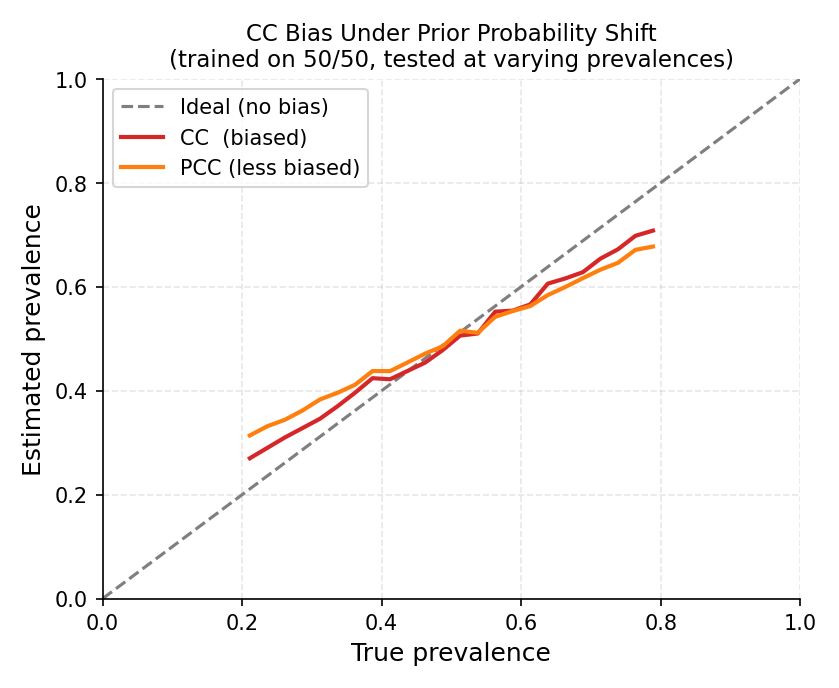
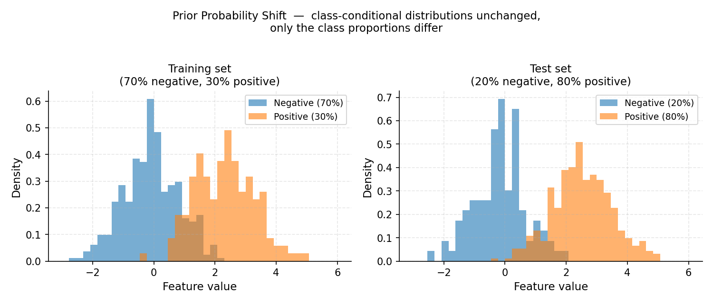
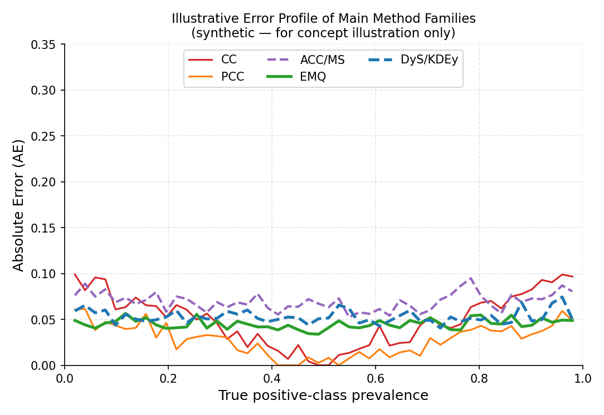

.. _quantification_foundations:

==========================
Quantification Foundations
==========================

This page introduces the core theory behind quantification — what the problem is,
why it differs from classification, how dataset shift motivates it, and how the
main method families address it. Reading this page will help you understand
**why** every parameter in every quantifier exists.

.. contents:: Contents
   :local:
   :depth: 2

----

What Is Quantification?
=======================

**Quantification** (also called *class prevalence estimation* or *class prior
estimation*) is the task of estimating the **proportion** — or *prevalence* — of
each class in an unlabelled dataset, rather than labelling individual instances.

Given:

- A labelled training set :math:`L = \{(x_i, y_i)\}_{i=1}^{n}` with
  :math:`y_i \in \{c_1, \ldots, c_k\}`,
- An unlabelled test set :math:`U = \{x_j\}_{j=1}^{m}`,

the goal is to estimate the vector of class prevalences

.. math::

   \hat{p}(c) = \frac{|\{x \in U : y = c\}|}{|U|}, \quad \forall c \in \mathcal{Y}.

The output is a probability vector :math:`\hat{p} \in \Delta^{k-1}` (the
probability simplex), where :math:`\hat{p}(c) \ge 0` and
:math:`\sum_c \hat{p}(c) = 1`.

.. admonition:: Quickstart analogy

   Imagine a hospital receives a batch of 1,000 blood samples. A pathologist does
   **not** need to diagnose every single patient — they need to know *how many*
   samples belong to each disease category to allocate resources. Quantification
   answers this aggregate question directly.

When Is Quantification the Right Tool?
---------------------------------------

Quantification is the right tool when:

- The final decision is about a **population**, not an individual (e.g. "how many
  tweets are about a product complaint?").
- Labelling every instance is too expensive, but estimating proportions is
  sufficient.
- The class distribution is expected to **shift** between training and deployment.
- Evaluation uses aggregate metrics (e.g. proportion of defective items in a
  production batch).

If you need a label for *each* instance, use a classifier. If you need the
proportions of a batch, use a quantifier.

----

Why Not Just Classify and Count?
==================================

The simplest approach — train a classifier, predict labels, count how many fall
into each class — is called **Classify and Count (CC)**. It is a valid baseline,
but it is systematically biased whenever the class distribution in the test set
differs from training.

The CC Bias
-----------

Suppose a binary classifier is trained on a balanced dataset (50% positive, 50%
negative) and achieves 90% accuracy. Now consider deploying it on a batch where
only 5% of instances are truly positive.

   *CC (red) systematically overshoots at low prevalence and undershoots at high
   prevalence. PCC (orange) is less biased but still not corrected. The dashed
   grey line is the ideal unbiased estimator.*

The classifier will generate:

- True positives: :math:`0.90 \times 0.05 = 0.045` (from 5% positives it gets
  right)
- False positives: :math:`0.10 \times 0.95 = 0.095` (from 95% negatives it
  misclassifies)

CC's estimated positive prevalence is :math:`0.045 + 0.095 = 0.14`, while the
true value is :math:`0.05` — an error of **9 percentage points**, even with a
very accurate classifier!

Forman (2005) showed empirically that CC consistently overestimates the minority
class when the test prevalence is low and underestimates it when high, regardless
of classifier accuracy. The bias is *systematic* and does not vanish with more
data. (Forman, 2005)

.. admonition:: Key insight

   A classifier optimises *instance-level* accuracy, not *aggregate-level*
   accuracy. The two objectives are different. Specialised quantification methods
   optimise directly for the latter.

----

Dataset Shift
=============

Quantification is intimately linked to **dataset shift** — the phenomenon where
the distribution of data changes between training and deployment.
(Moreno-Torres et al., 2012)

   *Prior probability shift: the feature distributions within each class (the
   histogram shapes) are identical between training and test, but the class
   proportions differ — 30% positive in training, 80% positive at test time.*

The three most relevant shift types for quantification are:

Prior Probability Shift (Label Shift)
--------------------------------------

The class-conditional distribution stays the same, but class priors change:

.. math::

   P_U(X \mid Y) = P_L(X \mid Y), \quad P_U(Y) \neq P_L(Y).

This is the *primary assumption* for most quantification methods. A sentiment
classifier trained in January may face a burst of positive reviews after a product
launch — the features of "positive review" have not changed, but the proportion
has.

**Methods that assume this shift:** CC, ACC, PCC, PACC, EMQ/SLD, DyS, HDy, KDEy.

Covariate Shift
---------------

The input distribution changes, but the conditional label distribution is stable:

.. math::

   P_U(Y \mid X) = P_L(Y \mid X), \quad P_U(X) \neq P_L(X).

This occurs when the input features come from a different domain (e.g. a model
trained on news articles applied to social media posts).

Concept Shift (Concept Drift)
------------------------------

The relationship between features and labels changes:

.. math::

   P_U(Y \mid X) \neq P_L(Y \mid X).

This is the hardest case. Most standard quantification methods cannot fully correct
for concept shift. Monitoring for drift and retraining are necessary.

.. tip::

   When you are unsure which shift applies, start with methods that assume **prior
   probability shift** (the most common case). If performance is poor, check
   whether the feature distribution has also shifted.

----

The Aggregative Quantification Framework
=========================================

Most quantification methods in ``mlquantify`` follow the **aggregative framework**
introduced by (Esuli et al., 2023):

1. **Fit** — Train an underlying classifier (estimator) on labelled data, obtaining
   a *representation* of the training class distributions (confusion matrix,
   score histograms, density estimates, …).

2. **Predict** — Apply the estimator to each test instance to obtain predictions
   (hard labels or soft probabilities).

3. **Aggregate** — Combine the individual predictions into a single prevalence
   estimate for the batch.

This design mirrors ``scikit-learn``'s *estimator* API: every aggregative
quantifier exposes ``fit(X, y)``, ``predict(X)``, and an additional ``aggregate``
method for when predictions are already available.

.. code-block:: python

   from mlquantify.counting import PCC
   from sklearn.linear_model import LogisticRegression

   # 1. Build and fit
   q = PCC(LogisticRegression())
   q.fit(X_train, y_train)

   # 2 & 3 combined — predict on new data
   prevalences = q.predict(X_test)

   # Or use aggregate if you already have posteriors
   proba = q.estimator_.predict_proba(X_test)
   prevalences = q.aggregate(proba)

.. _cross-validation-role:

The Role of Cross-Validation in ``fit``
----------------------------------------

Many aggregative methods need to estimate *how the classifier behaves on unseen
data* (e.g. to estimate TPR/FPR for ACC, or score histograms for DyS/HDy). Using
training-set predictions directly would give over-optimistic estimates.

To avoid this, ``mlquantify`` uses **cross-validated predictions** (also called
*hold-out predictions* or *calibrated predictions*) obtained by fitting the
estimator on a subset of the training data and predicting the held-out subset.
This is controlled by the ``cv`` parameter in ``fit``:

.. list-table::
   :widths: 20 80
   :header-rows: 1

   * - ``cv``
     - Behaviour
   * - ``int`` (e.g. 5)
     - K-fold cross-validation; predictions are assembled from K non-overlapping folds. Recommended.
   * - ``None``
     - The method uses its own default (usually 5-fold). Safe choice.
   * - Cross-validator object
     - E.g. ``StratifiedKFold(n_splits=10)``. Full control.

.. code-block:: python

   from mlquantify.counting import ACC
   from sklearn.svm import SVC

   # Use 10-fold stratified CV to estimate TPR/FPR
   q = ACC(SVC(probability=True), cv=10, stratified=True)
   q.fit(X_train, y_train)

.. warning::

   Setting ``cv`` to a very small value (e.g. 2) on a small dataset can
   produce noisy TPR/FPR or histogram estimates and hurt performance. The
   default of 5 is a safe balance between bias and variance.

The ``estimator_fitted`` parameter
------------------------------------

If you have already trained your classifier (e.g. in a pipeline), pass
``estimator_fitted=True`` to ``fit`` so ``mlquantify`` skips retraining and uses
the existing model:

.. code-block:: python

   from sklearn.ensemble import GradientBoostingClassifier

   clf = GradientBoostingClassifier().fit(X_train, y_train)

   # Skip refitting — use the already-trained clf
   q = PCC(clf)
   q.fit(X_train, y_train, estimator_fitted=True)

----

Method Families at a Glance
============================

   *Illustrative error profile across positive-class prevalence levels (synthetic
   data — for concept illustration only). CC and PCC are most biased at extreme
   prevalences. Adjusted counting (ACC/MS) partially corrects this. EMQ, DyS and
   KDEy achieve consistently low error across the full prevalence range.*

``mlquantify`` organises methods into families based on the **representation**
they build during training and the **correction strategy** they apply.

.. list-table::
   :widths: 20 25 25 30
   :header-rows: 1

   * - Family
     - Representation
     - Correction
     - When to use
   * - :ref:`Counting <counters_module>` (CC, PCC)
     - Hard / soft labels
     - None
     - Baseline; when training/test distributions are similar.
   * - :ref:`Adjusted Counting <counting>` (ACC, TAC, …)
     - Confusion matrix / ROC curve
     - Linear bias correction
     - Binary problems with known classifier error rates.
   * - :ref:`Likelihood <likelihood>` (EMQ, CDE)
     - Posterior probabilities
     - EM-based prior correction
     - Best single method under prior probability shift.
   * - :ref:`Distribution Matching <distribution_matching>` (DyS, HDy, KDEy)
     - Score histograms / densities
     - Mixture optimisation
     - Strong performance; good for binary and multiclass.
   * - :ref:`Nearest Neighbours <nearest_neighbors>` (PWK)
     - Feature space
     - Imbalance-aware k-NN
     - When a simple, interpretable baseline is needed.
   * - :ref:`Neural <neural_quantifiers>` (QuaNet)
     - Deep embeddings
     - Direct prevalence learning
     - Large datasets with rich feature representations.
   * - :ref:`Ensemble <ensemble>` (EnsembleQ, QuaDapt)
     - Any base quantifier
     - Diversity + selection
     - Robustness; when test prevalence is highly variable.

.. tip::

   If you are just getting started, try :class:`~mlquantify.likelihood.EMQ`
   with ``LogisticRegression`` — it is consistently among the top performers
   and requires minimal tuning. (Saerens et al., 2002) (Esuli et al., 2023)

----

Choosing the Right Evaluation Protocol
========================================

A single train/test split is often misleading for quantification because the
test prevalence is fixed. Dedicated protocols generate many test samples with
**different prevalences** from the same dataset:

- **APP (Artificial Prevalence Protocol)** — sweeps prevalences from 0 to 1 in
  uniform steps. Standard in quantification research. Use this by default.
- **UPP (Uniform Prevalence Protocol)** — samples prevalences uniformly from the
  simplex. Preferred for multiclass problems.
- **NPP (Natural Prevalence Protocol)** — draws random subsets preserving
  natural class proportions. Less controlled, more realistic.

See :ref:`quantification_protocols` for full details and code examples.

Choosing the Right Evaluation Metric
--------------------------------------

Quantification metrics penalise deviation between the estimated and true
prevalence vectors. The most important ones in ``mlquantify`` are:

.. list-table::
   :widths: 15 30 55
   :header-rows: 1

   * - Metric
     - Import
     - When to use
   * - MAE
     - ``mlquantify.metrics.MAE``
     - Default. Mean absolute difference per class. Interpretable.
   * - RAE
     - ``mlquantify.metrics.RAE``
     - When errors at low prevalences should be amplified (relative AE).
   * - KLD
     - ``mlquantify.metrics.KLD``
     - When probabilistic calibration of prevalences matters.
   * - NKLD
     - ``mlquantify.metrics.NKLD``
     - Normalised KLD; comparable across different class counts.
   * - MSE
     - ``mlquantify.metrics.MSE``
     - Squared error; penalises large deviations more heavily.

.. code-block:: python

   from mlquantify.metrics import MAE, RAE
   from mlquantify.utils import get_prev_from_labels

   true_prev  = get_prev_from_labels(y_test)
   pred_prev  = quantifier.predict(X_test)

   print(f"MAE:  {MAE(true_prev, pred_prev):.4f}")
   print(f"RAE:  {RAE(true_prev, pred_prev):.4f}")

----

Multiclass Quantification
==========================

All methods in ``mlquantify`` that are marked as *binary-only* are automatically
extended to multiclass problems via a **decomposition strategy**:

- **One-vs-Rest (OvR)** — for each class :math:`c`, train a binary quantifier
  that estimates :math:`\hat{p}(c)` vs. :math:`1 - \hat{p}(c)`, then renormalise.
  This is the default (``strategy='ovr'``).
- **One-vs-One (OvO)** — train a binary quantifier for every pair of classes
  :math:`(c_i, c_j)`, then combine estimates. Less common, set
  ``strategy='ovo'``.

Natively multiclass methods (CC, PCC, GACC, GPACC, EMQ, KDEy) operate directly
on :math:`k` classes without decomposition.

.. code-block:: python

   from mlquantify.counting import ACC
   from sklearn.linear_model import LogisticRegression
   from sklearn.datasets import make_classification

   X, y = make_classification(n_samples=500, n_classes=4,
                              n_informative=6, n_redundant=0,
                              random_state=42)

   # OvR decomposition is applied automatically
   q = ACC(LogisticRegression(), strategy='ovr')
   q.fit(X[:400], y[:400])
   q.predict(X[400:])

----

Further Reading
===============

For a comprehensive treatment of quantification theory, the canonical reference is:

- **Esuli, A., Fabris, A., Moreo, A., & Sebastiani, F. (2023).** *Learning to
  Quantify.* Springer. Open access at https://doi.org/10.1007/978-3-031-20467-8

For the original CC/AC paper:

- **Forman, G. (2005).** Counting Positives Accurately Despite Inaccurate
  Classification. *ECML 2005*, pp. 564–575.

For a comprehensive survey of quantification methods:

- **González, J., Díez, J., Chawla, N., & del Coz, J. J. (2017).** A Review on
  Quantification Learning. *ACM Computing Surveys*, 50(5), 1–40.
